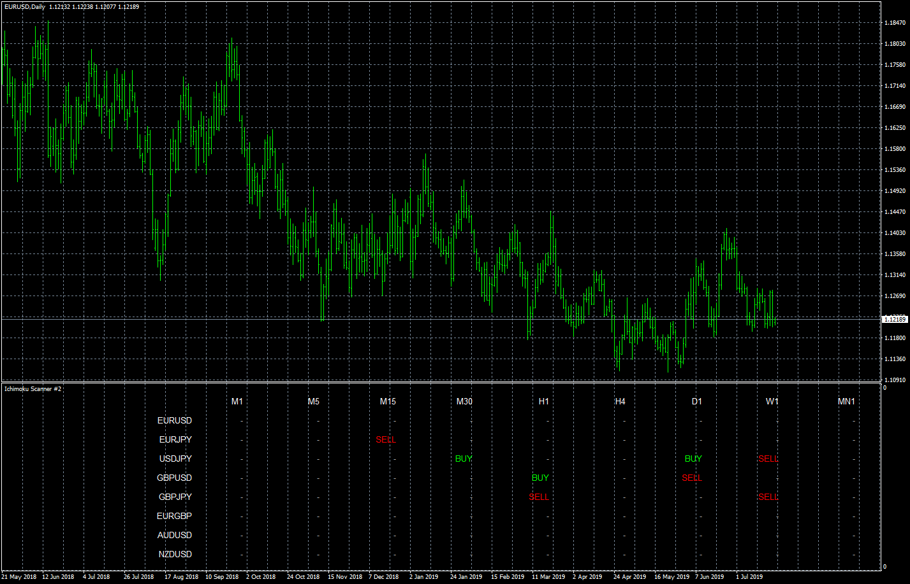
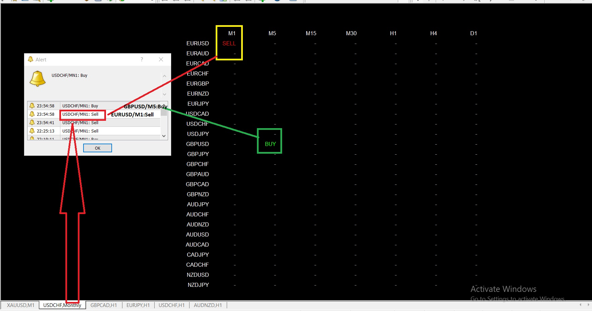
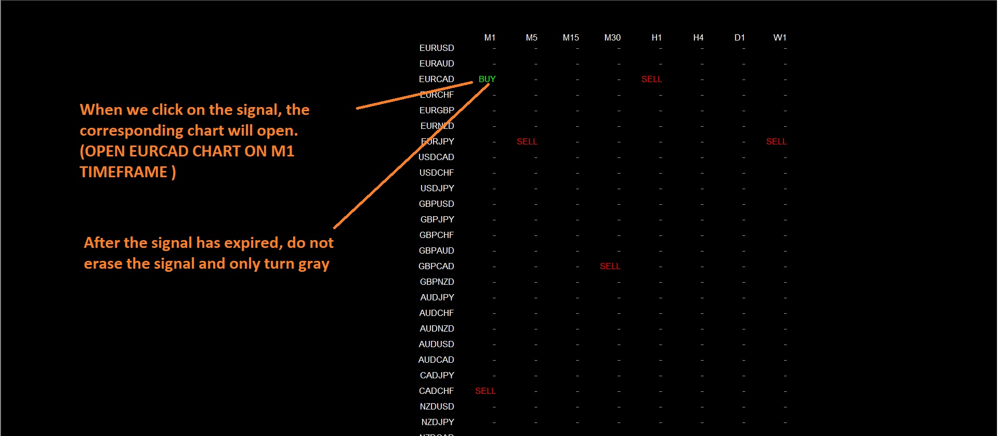
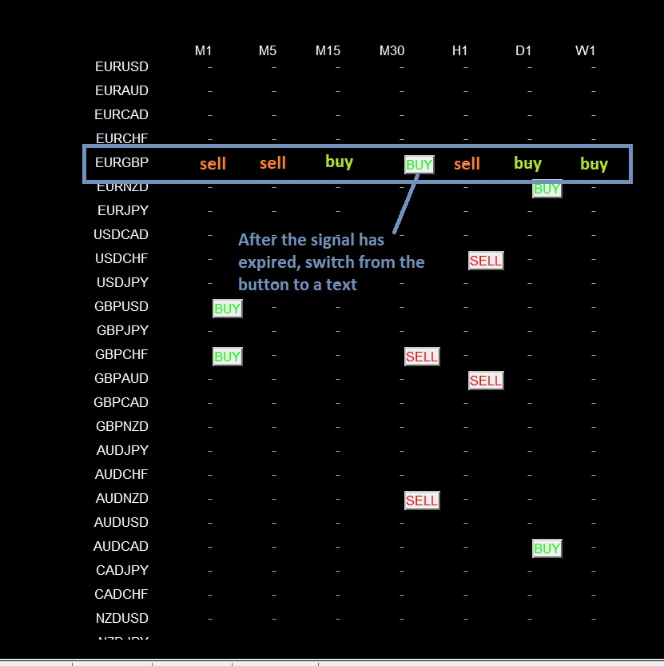
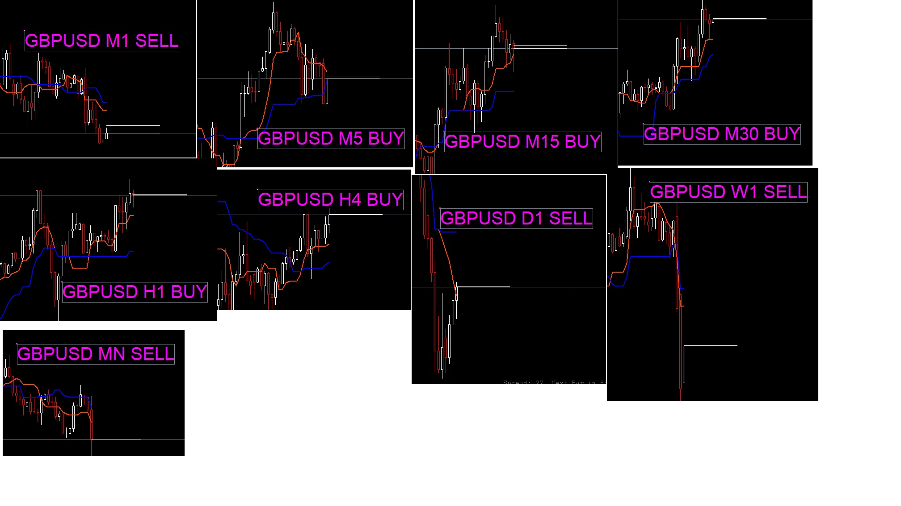
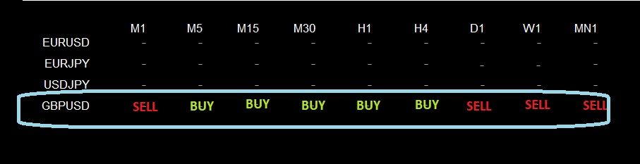
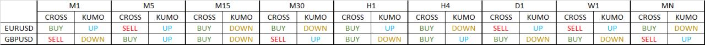
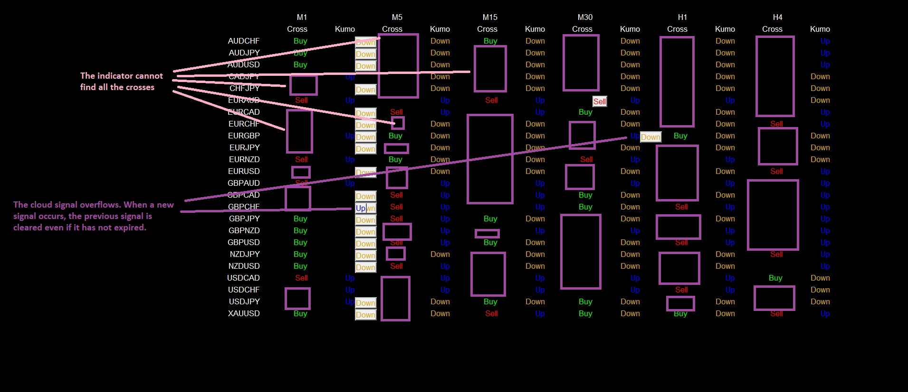
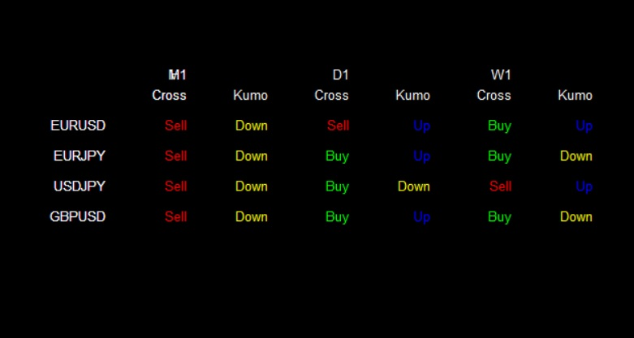
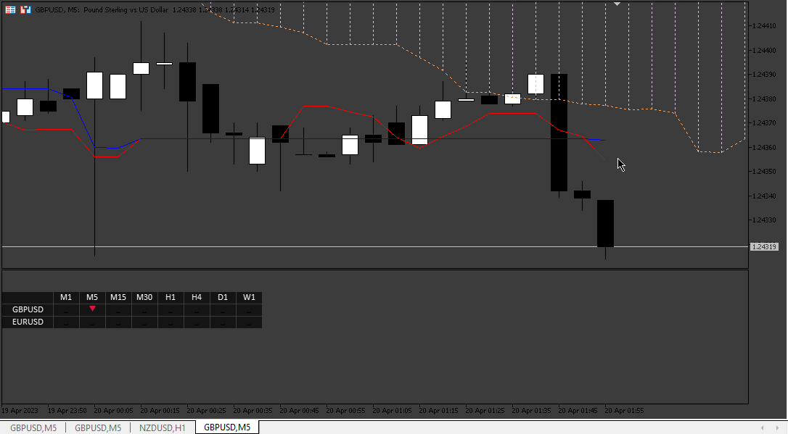

# Ichimoku Scanner

> Source: https://fxcodebase.com/code/viewtopic.php?f=38&t=68827  
> Forum: 38 · Topic 68827 · 47 post(s)

---

## Ichimoku Scanner

**Apprentice** · Wed Aug 21, 2019 3:04 pm

The attachment **eurusd-d1-forex-capital-markets.png** is no longer available

Based on request.
[viewtopic.php?f=27&t=68818](https://fxcodebase.com/code/viewtopic.php?f=27&t=68818)

 

 [Ichimoku Scanner v1.1.mq4](files/128099/Ichimoku%20Scanner%20v1.1.mq4)

---

## Re: Ichimoku Scanner

**trillionairemac** · Fri Oct 11, 2019 7:19 am

Could you make an Ichimoku EA?

---

## Re: Ichimoku Scanner

**Apprentice** · Fri Oct 11, 2019 10:10 am

Sure.
We will need EA rules.

---

## Re: Ichimoku Scanner

**trillionairemac** · Wed Oct 23, 2019 6:31 pm

EA RULES:

BUY-
1: Price to Break and close above the Ichimoku Cloud
2:The Conversion Line needs to break above the Base Line
3: Buy after the crossover at the opening of the next candle.
4: Place protective stop loss below the Candle that broke out above the cloud
5: Take Profit when the Conversion Line crosses below the Base Line.

SELL-
1: Price to Break and close below the Ichimoku Cloud
2: The Conversion line needs to break below the baseline
3. Sell after the crossover (in step 2) at the opening of the next candle.
4. Place Protective SL above the candle that broke below the cloud.
5: Take profit when the conversion line crosses above the baseline.

---

## Re: Ichimoku Scanner

**Apprentice** · Wed Oct 23, 2019 6:36 pm

Your request is added to the development list.
Development reference 233.

---

## Re: Ichimoku Scanner

**Apprentice** · Thu Oct 24, 2019 5:04 am

What is conversion and base lines? Usually, Ichimoku lines are named Tenkan/Kijun/Chikou.

---

## Re: Ichimoku Scanner

**trillionairemac** · Mon Oct 28, 2019 12:15 pm

> **Apprentice wrote:**
> What is conversion and base lines? Usually, Ichimoku lines are named Tenkan/Kijun/Chikou.

BUY-
1: Price closes above SENKOU SPAN B
2: TENKAN breaks above KIJUN
3: CHIKOU breaks above SENKOU SPAN B
4: Place protective stop loss below the Candle that broke out above the cloud
5: Take Profit when the TEKAN crosses below the KIJUN.

SELL-
1: Price closes below SENKOU SPAN A
2: TENKAN breaks below KIJUN
3. CHIKOU breaks below SENKOU SPAN B
4. Place Protective SL above the candle that broke below the cloud.
5: Take profit when the TEKAN crosses above theKIJUN.

---

## Re: Ichimoku Scanner

**Apprentice** · Tue Oct 29, 2019 6:25 am

Your request is added to the development list.
Development reference 255.

---

## Re: Ichimoku Scanner

**Apprentice** · Thu Oct 31, 2019 6:32 am

Try this version.
[viewtopic.php?f=38&t=69074](https://fxcodebase.com/code/viewtopic.php?f=38&t=69074)

---

## Re: Ichimoku Scanner

**zero999** · Mon Mar 16, 2020 1:03 pm

> **Apprentice wrote:**
> Try this version.
> [viewtopic.php?f=38&t=69074](https://fxcodebase.com/code/viewtopic.php?f=38&t=69074)

Hi
Can you change the alarms of this indicator?
When the alarms are written in the alarms text of the currency pair and timeframe where the cross occurs
Do not clear the signal after the signal time has expired. Its color will be gray
Clicking on the signal opens the currency pair chart in that time frame

---

## Re: Ichimoku Scanner

**Apprentice** · Mon Mar 16, 2020 1:54 pm

Your request is added to the development list.
Development reference 881.

---

## Re: Ichimoku Scanner

**Apprentice** · Tue Mar 17, 2020 12:38 pm

You want an alert on crosses only?
I don't understand the request. Alert does have a symbol, timeframe in the text.

---

## Re: Ichimoku Scanner

**zero999** · Tue Mar 17, 2020 5:27 pm

> **Apprentice wrote:**
> You want an alert on crosses only?
> I don't understand the request. Alert does have a symbol, timeframe in the text.

 

Consider this example
Time 1 minute in the euro-dollar cross-in occurred, but the text was not written alarms euro-dollar

---

## Re: Ichimoku Scanner

**Apprentice** · Thu Mar 19, 2020 6:33 am

[Ichimoku Scanner.mq4](files/132085/Ichimoku%20Scanner.mq4)

Try this version.

---

## Re: Ichimoku Scanner

**zero999** · Thu Mar 19, 2020 8:32 am

> **Apprentice wrote:**
>
>
> The attachment **Ichimoku Scanner.mq4** is no longer available
>
>
> Try this version.

Thanks for the alarm
You can also do the following changes?
When we click on the signal, the corresponding chart will open
After the signal has expired, do not erase the signal and only turn gray

 

---

## Re: Ichimoku Scanner

**Apprentice** · Thu Mar 19, 2020 9:20 am

Your request is added to the development list.
Development reference 905.

---

## Re: Ichimoku Scanner

**Apprentice** · Mon Mar 23, 2020 6:07 am

[Ichimoku Scanner.mq4](files/132190/Ichimoku%20Scanner.mq4)

Try this version.

---

## Re: Ichimoku Scanner

**zero999** · Mon Mar 23, 2020 9:53 am

> **Apprentice wrote:**
>
>
> The attachment **Ichimoku Scanner.mq4** is no longer available
>
>
> Try this version.

Thanks for correcting the indicator
In fact, I want to open a new chart every time I click on the button
After the timeout, the signal is cleared from the chart
In fact, I want it to look like a scanner

 

Thank you for your attention

---

## Re: Ichimoku Scanner

**Apprentice** · Tue Mar 24, 2020 9:07 am

Your request is added to the development list.
Development reference 935.

---

## Re: Ichimoku Scanner

**Apprentice** · Thu Mar 26, 2020 7:16 am

[Ichimoku Scanner.mq4](files/132308/Ichimoku%20Scanner.mq4)

Something like this?

---

## Re: Ichimoku Scanner

**zero999** · Thu Mar 26, 2020 10:17 am

> **Apprentice wrote:**
>
>
> The attachment **Ichimoku Scanner.mq4** is no longer available
>
>
> Something like this?

Look at this picture carefully

 

The indicator should check all the time frames of a currency pair when executed
In the line corresponding to it, write the last cross it finds
When a new cross occurs, give alarms and switch buttons
When the signal has expired switch from button mode to remain as text
The final image of the scanner should look like a GBPUSD row

 

I'm sorry if I can't explain clearly

---

## Re: Ichimoku Scanner

**Apprentice** · Fri Mar 27, 2020 6:48 am

Your request is added to the development list.
Development reference 955.

---

## Re: Ichimoku Scanner

**Apprentice** · Mon Mar 30, 2020 7:32 am

[Ichimoku Scanner.mq4](files/132377/Ichimoku%20Scanner.mq4)

Try this version.

---

## Re: Ichimoku Scanner

**zero999** · Mon Mar 30, 2020 4:24 pm

Thanks a lot
My latest request to complete this scanner is to add the kumo cloud.
To make my point better, I draw a schematic view in the Excel file
Do exactly the same thing to draw the KUMO cloud direction (alarms. Button. Scan the latest KUMO)
thanks again

 

---

## Re: Ichimoku Scanner

**Apprentice** · Tue Mar 31, 2020 5:17 am

Your request is added to the development list.
Development reference 972.

---

## Re: Ichimoku Scanner

**zero999** · Wed Apr 01, 2020 9:32 am

Please correct these bugs

 

---

## Re: Ichimoku Scanner

**Apprentice** · Thu Apr 02, 2020 5:09 am

Your request is added to the development list.
Development reference 991.

---

## Re: Ichimoku Scanner

**Apprentice** · Fri Apr 03, 2020 6:00 am

[Ichimoku Scanner.mq4](files/132556/Ichimoku%20Scanner.mq4)

Try this version.

---

## Re: Ichimoku Scanner

**zero999** · Tue Apr 07, 2020 4:35 pm

> **Apprentice wrote:**
>
>
> Ichimoku Scanner.mq4
>
>
> Try this version.

Thankful
It's very good
Is it possible to add more features later?

---

## Re: Ichimoku Scanner

**Apprentice** · Wed Apr 08, 2020 4:16 am

Sure.

---

## Re: Ichimoku Scanner

**zero999** · Thu May 21, 2020 10:28 am

Hello
Can you write a scanner like this for offline charts?
An offline chart created with the RENKO indicator

---

## Re: Ichimoku Scanner

**Apprentice** · Fri May 22, 2020 6:42 am

Your request is added to the development list.
Development reference 1330.

---

## Re: Ichimoku Scanner

**Jjoetong** · Wed May 27, 2020 1:51 pm

Hi there,

Could you help me create an EA with the following parameters ?

Buy :
1. Enter when candlestick crosses above Kijun-Sen, Exit when candlestick closes below kijun-sen.
2. Enter when candlestick breaks above Kumo Cloud, Exit when candlestick closes below kumo cloud.
3. Auto Trailing Stop Loss at 300 points.

Sell :
1. Enter when candlestick crosses below Kijun-Sen, Exit when candlestick closes above kijun-sen.
2. Enter when candlestick breaks below Kumo Cloud, Exit when candlestick exits above kumo cloud.
3. Auto Trailing Stop Loss at 300 points.

Other Settings :
1. Allow lot size setting.
2. Allow alerts and pop up notifications.
3. Allow buy and sell positions opened at the same time.

Thanks

---

## Re: Ichimoku Scanner

**Apprentice** · Wed May 27, 2020 4:03 pm

Your request is added to the development list.
Development reference 1381.

---

## Re: Ichimoku Scanner

**Apprentice** · Thu Jun 11, 2020 6:01 am

Try this version.
[viewtopic.php?f=38&t=70001](https://fxcodebase.com/code/viewtopic.php?f=38&t=70001)

---

## Re: Ichimoku Scanner

**zero999** · Thu Jun 25, 2020 11:44 am

> **Apprentice wrote:**
>
>
> Ichimoku Scanner.mq4
>
>
> Try this version.

Hello Apprentice
I need to add a few items to this scanner.

Item One: ROAD CROSS
When the Tenkan and Kijun exactly overlap (The value of both is exactly the same.) Road Cross occurs
Whenever Road Cross occurs, write the word RC in yellow in the Cross section.

Item Two:
Advanced alarm
I need a separate alarm for each part of the scanner
1 Cross alarm
 (Alarm text: symbole name / Time frame: sell or buy)
2 kumo switches
 (Alarm text: symbole name / Time frame: Kumo UP or Kumo DOWN)
3 Road cross
 (Alarm text: symbole name / Time frame: Road Cross)

---

## Re: Ichimoku Scanner

**Apprentice** · Thu Jun 25, 2020 1:34 pm

Your request is added to the development list.
Development reference 1559.

---

## Re: Ichimoku Scanner

**Apprentice** · Fri Jun 26, 2020 3:54 am

[Ichimoku Scanner v1.5.mq4](files/135319/Ichimoku%20Scanner%20v1.5.mq4)

Try this version.

---

## Re: Ichimoku Scanner

**zero999** · Fri Jun 26, 2020 1:48 pm

> **Apprentice wrote:**
>
>
> Ichimoku Scanner v1.5.mq4
>
>
> Try this version.

Thanks a lot
You and your team work great

Can you get a scanner for a non-default ichimoku indicator?
This indicator uses the processing file and I do not have access to its mql4 file

---

## Re: Ichimoku Scanner

**Apprentice** · Sun Jun 28, 2020 4:33 am

If you do not have code,
can you provide non-default Ichimoku description or rules?

---

## Re: Ichimoku Scanner

**zero999** · Sun Jun 28, 2020 12:00 pm

> **Apprentice wrote:**
> If you do not have code,
> can you provide non-default Ichimoku description or rules?

This indicator uses some filters that select specific crosses
I don't know the rules for filters
I will send you the indicator in a personal message

---

## Re: Ichimoku Scanner

**Apprentice** · Fri Jul 03, 2020 7:38 am

Task 1330

 [Renko Ichimoku Scanner.mq4](files/135608/Renko%20Ichimoku%20Scanner.mq4)

---

## Re: Ichimoku Scanner

**zero999** · Sat Jul 04, 2020 12:01 pm

> **Apprentice wrote:**
> Task 1330
>
>
> The attachment **Renko Ichimoku Scanner.mq4** is no longer available

Hello dear Mario
In Renko charts, time is practically eliminated and the chart is formed based on price.
The scanner is shown to be incorrect. And it doesn't match the Renko chart

 

I use this indicator for the Renko chart

 [FX Blue - Renko Bars.ex4](files/135629/FX%20Blue%20-%20Renko%20Bars.ex4)

In fact, in this scanner, instead of a time frame, we have to use price steps

 

 

---

## Re: Ichimoku Scanner

**Frank8093** · Thu Apr 15, 2021 8:37 am

Hi Team
how are you
can you check this program. i think the program has problem in commands.

1- in Down or Up section in ICHIMOKU SCANNER :

IICHIMOKU Command : Period + 1 : means next candle Period : current candle

but according to the commands it means period +1 current candle and Period means next candle.

please revise it.

 UpCondition(const string symbol, ENUM_TIMEFRAMES timeframe)
 :ACondition(symbol, timeframe)
 {
 }

 virtual bool IsPass(const int period, const datetime date)
 {
 double TENKANSEN_0 = iIchimoku(_symbol, _timeframe, Tenkan_Sen_Period, Kijun_Sen_Period, Senkou_Span_B_Period, 1, period);
 double KIJUNSEN_0 = iIchimoku(_symbol, _timeframe, Tenkan_Sen_Period, Kijun_Sen_Period, Senkou_Span_B_Period, 2, period);
 double TENKANSEN_1 = iIchimoku(_symbol, _timeframe, Tenkan_Sen_Period, Kijun_Sen_Period, Senkou_Span_B_Period, 1, period + 1);
 double KIJUNSEN_1 = iIchimoku(_symbol, _timeframe, Tenkan_Sen_Period, Kijun_Sen_Period, Senkou_Span_B_Period, 2, period + 1);

 return TENKANSEN_0 > KIJUNSEN_0 && TENKANSEN_1 <= KIJUNSEN_1;

 DownCondition(const string symbol, ENUM_TIMEFRAMES timeframe)
 :ACondition(symbol, timeframe)
 {
 }

 virtual bool IsPass(const int period, const datetime date)
 {
 double TENKANSEN_0 = iIchimoku(_symbol, _timeframe, Tenkan_Sen_Period, Kijun_Sen_Period, Senkou_Span_B_Period, 1, period);
 double KIJUNSEN_0 = iIchimoku(_symbol, _timeframe, Tenkan_Sen_Period, Kijun_Sen_Period, Senkou_Span_B_Period, 2, period);
 double TENKANSEN_1 = iIchimoku(_symbol, _timeframe, Tenkan_Sen_Period, Kijun_Sen_Period, Senkou_Span_B_Period, 1, period + 1);
 double KIJUNSEN_1 = iIchimoku(_symbol, _timeframe, Tenkan_Sen_Period, Kijun_Sen_Period, Senkou_Span_B_Period, 2, period + 1);

 return TENKANSEN_0 < KIJUNSEN_0 && TENKANSEN_1 >= KIJUNSEN_1;

2- in Road Cross Condition : we want when in the specified time frame in iichimoku command occured.
the alert has been showed.
but when the timeframe in iichimoku specified the alert show all timeframe of symbols that the road cross occured.

3- please revise the alert show. because the alert show multi again alert for expired signal.
for example the sell signal in eurusd occured now the alert show it now and also after 1 hour or before next signal show again sell on eurusd.

4- i want when in two time or 3 or 4 timeframe together occured RC (Road Cross).
Tenkan and Kijun are same (overlap) in 2 or 3 or 4 timeframe.
Tenkan = Kijun (M5) , Tenkan = Kijun (M15) , Tenkan = Kijun (M30) , Tenkan = Kijun (H1)
Message alert show same as below :
Symbol , Timeframe : M5 , M15 , M30 , H1 -- Road Cross in Tenkan & Kijun

thanks

---

## Re: Ichimoku Scanner

**ben3131** · Mon Apr 17, 2023 11:07 am

Hello Apprentice,

Could you convert your indicator (page 2) of this forum in MT5 ? :

"Re: Ichimoku Scanner
Postby Apprentice » Thu Mar 26, 2020 2:16 pm

 Ichimoku Scanner.mq4
(26.41 KiB) Downloaded 350 times"

Thanks in advance,
Ben

---

## Re: Ichimoku Scanner

**Apprentice** · Wed Apr 19, 2023 5:34 am

We have added your request to the development list.
Development reference 337.

---

## Re: Ichimoku Scanner

**Apprentice** · Sun Apr 23, 2023 2:34 pm

 [Ichimoku_Scanner_MT5.mq5](files/150557/Ichimoku_Scanner_MT5.mq5)
