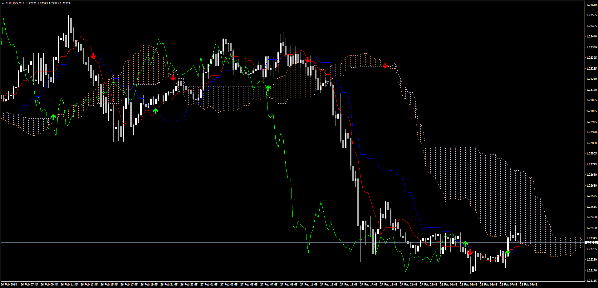

# Ichimoku Signals and Alerts

> Source: https://fxcodebase.com/code/viewtopic.php?f=38&t=65794  
> Forum: 38 · Topic 65794 · 22 post(s)

---

## Ichimoku Signals and Alerts

**Apprentice** · Thu Mar 01, 2018 6:29 am

LUA Original: [viewtopic.php?f=17&t=60794](https://fxcodebase.com/code/viewtopic.php?f=17&t=60794)

Description:

This is the MT4 version of the LUA original indicator that provides Signals and Alerts given by crossing of Price with components of the Ichimoku:

- Kijun-sen with Price
- Senkou span A with Price
- Senkou span B with Price
- Tenkan-sen with Kijun-sen
- Senkou span A with Senkou span B

 [Ichimoku_Signals_and_Alert.mq4](files/117963/Ichimoku_Signals_and_Alert.mq4)

 [Ichimoku_Signals_and_Alert.mq5](files/117963/Ichimoku_Signals_and_Alert.mq5)

---

## Re: Ichimoku Signals and Alerts

**faro12** · Wed Nov 28, 2018 2:11 am

first, thanks for your great work on the ichimoku indicator
My problem is that i can't always trade on my pc, can you install a PushNotification please?
So I can see ichimoku Alert notification on my smatphone

---

## Re: Ichimoku Signals and Alerts

**Apprentice** · Wed Nov 28, 2018 5:16 am

Your request is added to the development list under Id Number 4333

---

## Re: Ichimoku Signals and Alerts

**Apprentice** · Sat Dec 01, 2018 4:57 am

Try it now.

---

## Re: Ichimoku Signals and Alerts

**octaviomejia** · Fri Oct 11, 2019 10:17 am

Hello! This indicator is awesome, however, could it be possible to add the Price Tenkan-Sen cross alert?

Thank you!

---

## Re: Ichimoku Signals and Alerts

**Apprentice** · Sat Oct 12, 2019 5:03 am

Your request is added to the development list.
Development reference 186.

---

## Re: Ichimoku Signals and Alerts

**Apprentice** · Tue Oct 15, 2019 1:16 pm

It's already there.

---

## Re: Ichimoku Signals and Alerts

**octaviomejia** · Fri Oct 25, 2019 9:35 am

> **Apprentice wrote:**
> It's already there.

Thank you, Apprentice!

There is an alert for the Tenkan-Sen Kijun-Sen cross. However, I don't see the signal for the Price Tenkan-Sen cross.

Best regards

---

## Re: Ichimoku Signals and Alerts

**Apprentice** · Sun Oct 27, 2019 4:48 am

Your request is added to the development list.
Development reference 251.

---

## Re: Ichimoku Signals and Alerts

**Apprentice** · Thu Oct 31, 2019 6:11 am

[Ichimoku_Signals_and_Alert.mq4](files/129505/Ichimoku_Signals_and_Alert.mq4)

Try this version.

---

## Re: Ichimoku Signals and Alerts

**octaviomejia** · Fri Nov 08, 2019 10:55 am

> **Apprentice wrote:**
>
>
> Ichimoku_Signals_and_Alert.mq4
>
>
> Try this version.

Thank you! It works perfectly.

Have a great weekend!

---

## Re: Ichimoku Signals and Alerts

**dotori** · Wed Jul 29, 2020 11:01 am

Hi Apprentice

I loaded the indicator on MT4 but it has way too many signals compared to the very first image you posted here in the very first post.

Please take a look at the screenshot below. Is this correct? Something is not correctly set or what am i missing here?

[http://prnt.sc/tql82y](http://prnt.sc/tql82y)

Thanks

---

## Re: Ichimoku Signals and Alerts

**Apprentice** · Wed Jul 29, 2020 4:06 pm

Your request is added to the development list.
Development reference 1793.

---

## Re: Ichimoku Signals and Alerts

**Apprentice** · Thu Jul 30, 2020 4:26 pm

This is the expected behavior.
 You can disable alerts you don't need in the indicator options.

---

## Re: Ichimoku Signals and Alerts

**IlY11s** · Tue Mar 08, 2022 10:47 am

can you please make senkou span A-B Alerts on close Bar ?

---

## Re: Ichimoku Signals and Alerts

**Apprentice** · Wed Mar 09, 2022 11:53 am

Your request is added to the development list.
Development reference 146.

---

## Re: Ichimoku Signals and Alerts

**siapmn** · Thu Jun 09, 2022 7:46 am

Hi
Can i request the LUA version of this indicator ?

tnx bro

---

## Re: Ichimoku Signals and Alerts

**Apprentice** · Fri Jun 10, 2022 5:53 am

LUA Original: [viewtopic.php?f=17&t=60794](https://fxcodebase.com/code/viewtopic.php?f=17&t=60794)

---

## Re: Ichimoku Signals and Alerts

**irlindark** · Wed May 17, 2023 4:08 am

Hi thx for your work. Can i have a version fot mt5? thx

---

## Re: Ichimoku Signals and Alerts

**Apprentice** · Fri May 19, 2023 6:40 am

We have added your request to the development list.
Development reference 440.

---

## Re: Ichimoku Signals and Alerts

**Apprentice** · Wed Jun 28, 2023 11:40 am

Ichimoku_Signals_and_Alert.mq5 added.

---

## Re: Ichimoku Signals and Alerts

**Apprentice** · Thu Jan 30, 2025 5:22 am

Already completed: [https://fxcodebase.com/code/viewtopic.p ... 05#p129505](https://fxcodebase.com/code/viewtopic.php?p=129505#p129505)
