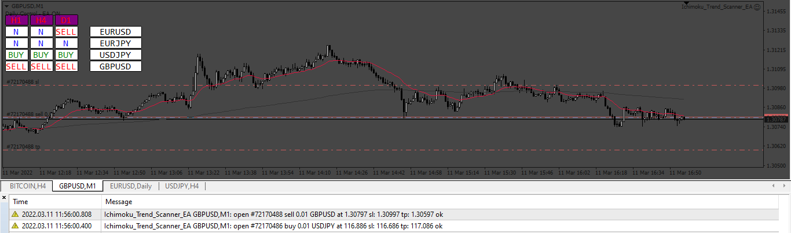
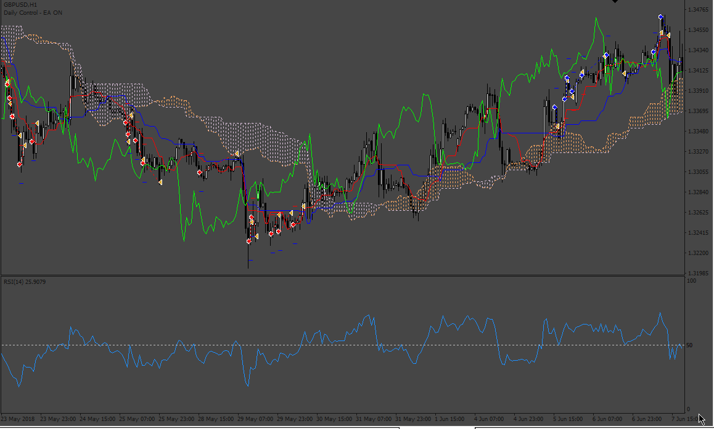
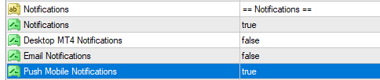

# Ichimoku_Trend_Scanner_EA

> Source: https://fxcodebase.com/code/viewtopic.php?f=38&t=71993  
> Forum: 38 · Topic 71993 · 6 post(s)

---

## Ichimoku_Trend_Scanner_EA

**Apprentice** · Tue Mar 22, 2022 11:15 am

Based on the request.
[https://fxcodebase.com/code/viewtopic.php?f=38&p=145010](https://fxcodebase.com/code/viewtopic.php?f=38&p=145010)

 [Ichimoku_Trend_Scanner_EA.mq4](files/145412/Ichimoku_Trend_Scanner_EA.mq4)

---

## Re: Ichimoku_Trend_Scanner_EA

**Raffus** · Fri Apr 15, 2022 7:23 am

hello @apprentice,
please can u make me a updated Version?

i would like to catch the beginning of the trend, so i need to meet these rules in order to enter.

selling orders:
-candle brokes down the cloud
-red line below blue line (the crossing can be done before the cloud)
-RSI under 50 value

buying order
-candle brokes up the cloud
-red line above blue line (the crossing can be done before the cloud)
-RSI above 50 value

RSI to 14 or customizable value
thanks a lot for your job

best regards

---

## Re: Ichimoku_Trend_Scanner_EA

**Apprentice** · Tue Apr 19, 2022 9:28 am

Your request is added to the development list.
Development reference 249.

---

## Re: Ichimoku_Trend_Scanner_EA

**Apprentice** · Wed Sep 21, 2022 1:46 am

 [Ichimoku_Trend_Scanner_EA.mq4](files/147515/Ichimoku_Trend_Scanner_EA.mq4)

---

## Re: Ichimoku_Trend_Scanner_EA

**ONWAY234** · Wed Nov 30, 2022 6:42 am

Hi,

There is no popup alert from the scanner even though I have turned the "Notifications on" for mt4.

---

## Re: Ichimoku_Trend_Scanner_EA

**Apprentice** · Wed Dec 28, 2022 12:13 pm

Try it now.
