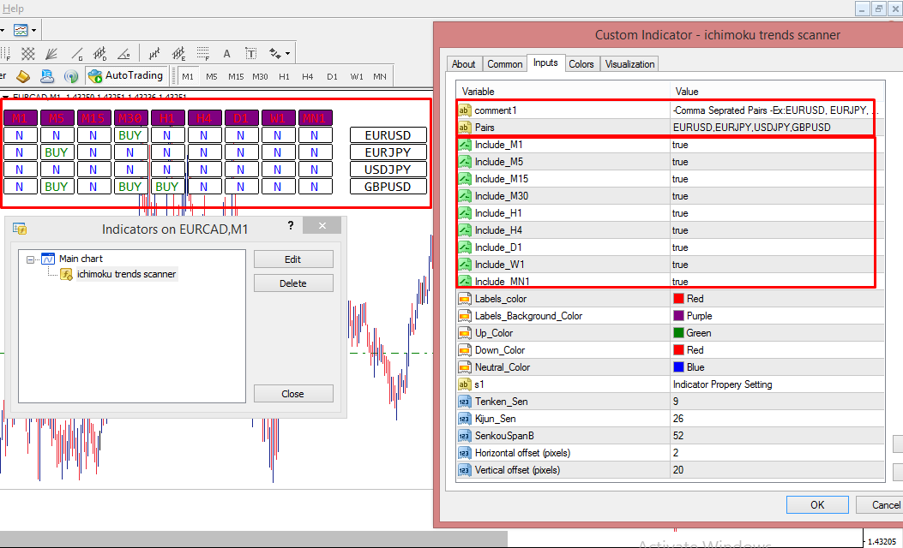

# ichimoku_trends_scanner

> Source: https://fxcodebase.com/code/viewtopic.php?f=38&t=71855  
> Forum: 38 · Topic 71855 · 6 post(s)

---

## ichimoku_trends_scanner

**Apprentice** · Fri Feb 04, 2022 2:57 am

Based on the request.
[https://fxcodebase.com/code/viewtopic.php?f=27&p=144723](https://fxcodebase.com/code/viewtopic.php?f=27&p=144723)

 [ichimoku_trends_scanner.mq4](files/144945/ichimoku_trends_scanner.mq4)

---

## Re: ichimoku_trends_scanner

**nnbite** · Sat Feb 12, 2022 11:28 am

Can it be made into ea version?

---

## Re: ichimoku_trends_scanner

**Apprentice** · Mon Feb 14, 2022 3:35 am

Your request is added to the development list.
Development reference 94.

---

## Re: ichimoku_trends_scanner

**Lionel** · Tue Mar 08, 2022 6:23 pm

thank you for the indicator you are great, it works very well but it would be nice if we could load the corresponding chart just by clicking on buy or sell. Thanks again for the good work.

---

## Re: ichimoku_trends_scanner

**Lionel** · Fri Mar 11, 2022 4:35 am

there is one thing that i also noticed is that it does not refresh the list automatically. I have to change the unit of time for it to do so.

---

## Re: ichimoku_trends_scanner

**Apprentice** · Tue Mar 22, 2022 11:16 am

Try this version of EA
[https://fxcodebase.com/code/viewtopic.php?f=38&t=71993](https://fxcodebase.com/code/viewtopic.php?f=38&t=71993)
