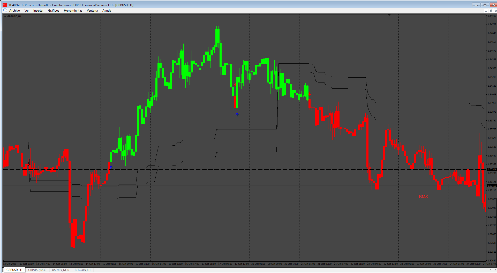

# ICT_Donchian_Smart_Money_Structure

> Source: https://fxcodebase.com/code/viewtopic.php?f=38&t=75503  
> Forum: 38 · Topic 75503 · 7 post(s)

---

## ICT_Donchian_Smart_Money_Structure

**Apprentice** · Wed Jan 15, 2025 5:32 am

Based on the request.
[https://fxcodebase.com/code/viewtopic.p ... 51#p153851](https://fxcodebase.com/code/viewtopic.php?f=17&p=153851#p153851)

 [ICT_Donchian_Smart_Money_Structure.mq4](files/157826/ICT_Donchian_Smart_Money_Structure.mq4)

 [ICT_Donchian_Smart_Money_Structure.mq5](files/157826/ICT_Donchian_Smart_Money_Structure.mq5)

---

## Re: ICT_Donchian_Smart_Money_Structure

**rickCreations** · Sun Jan 19, 2025 11:11 am

can we make it look the same as the .lua version where you can see the gradient different donchain paths. i know its possible because the luxalgo mt4 version of his Smartmoney has it.

---

## Re: ICT_Donchian_Smart_Money_Structure

**Apprentice** · Thu Jan 23, 2025 3:39 pm

We have added your request to the development list.
Development reference 61

---

## Re: ICT_Donchian_Smart_Money_Structure

**Apprentice** · Thu Jan 30, 2025 5:21 am

Done for MT5 (fixed some issues).
MT4 doesn’t support such an out-of-the-box drawing.
luxalgo must be using some trick for that

 [ICT_Donchian_Smart_Money_Structure.mq5](files/158060/ICT_Donchian_Smart_Money_Structure.mq5)

---

## Re: ICT_Donchian_Smart_Money_Structure

**khanatd** · Tue Oct 21, 2025 1:05 am

hi sir plz add mt4 non repaint arrows at close of current candle or reversals/continuations /breakouts etc

thanks
khan

---

## Re: ICT_Donchian_Smart_Money_Structure

**Apprentice** · Tue Oct 21, 2025 9:36 am

We have added your request to the development list.
Development reference 676

---

## Re: ICT_Donchian_Smart_Money_Structure

**Apprentice** · Wed Oct 29, 2025 5:19 am

 [ICT_Donchian_Smart_Money_Structure.mq5](files/161068/ICT_Donchian_Smart_Money_Structure.mq5)
