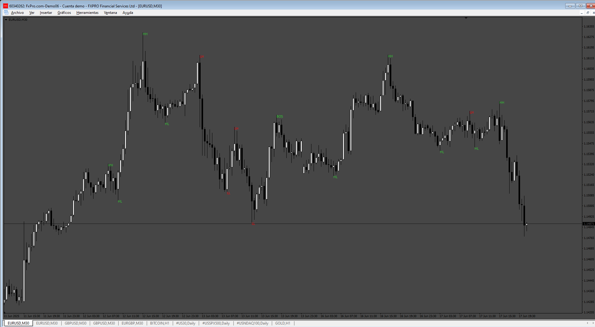
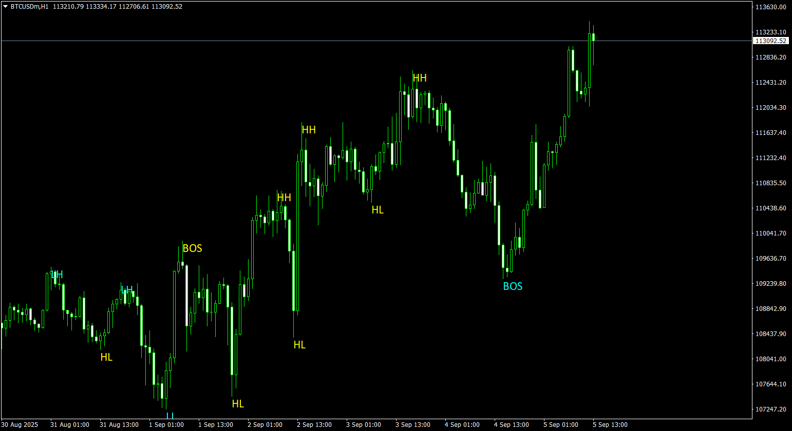
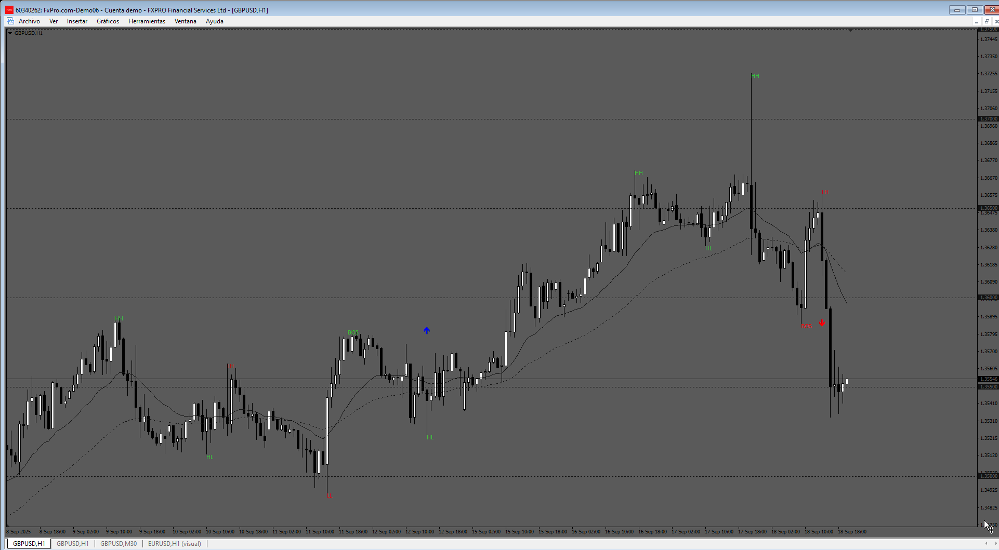

# ICT_Market_Structure

> Source: https://fxcodebase.com/code/viewtopic.php?f=38&t=76048  
> Forum: 38 · Topic 76048 · 9 post(s)

---

## ICT_Market_Structure

**Apprentice** · Fri Jun 20, 2025 3:13 am

TS2 version.
[https://fxcodebase.com/code/viewtopic.p ... 74#p159374](https://fxcodebase.com/code/viewtopic.php?f=17&p=159374#p159374)

 [ICT_Market_Structure.mq4](files/159652/ICT_Market_Structure.mq4)

---

## Re: ICT_Market_Structure

**wanzulkifli** · Fri Aug 22, 2025 6:52 am

Hi Apprentice,

This indi seems arrow not appear, but that's ok for me because the HH HL LH LL and BOS label still there, but can you add more input for adjust the positon or shift the label,size and the colour of the labels?

Much appreciated

Thank you

---

## Re: ICT_Market_Structure

**Apprentice** · Mon Aug 25, 2025 2:34 am

We have added your request to the development list.
Development reference 536

---

## Re: ICT_Market_Structure

**Apprentice** · Tue Sep 09, 2025 4:01 am

 [ICT_Market_Structure.mq4](files/160508/ICT_Market_Structure.mq4)

---

## Re: ICT_Market_Structure

**khanatd** · Sun Sep 14, 2025 8:23 pm

hi sir plz add arrows in it mt4 version

thanks,
khan

---

## Re: ICT_Market_Structure

**Apprentice** · Mon Sep 15, 2025 12:34 pm

We have added your request to the development list.
Development reference 581

---

## Re: ICT_Market_Structure

**Apprentice** · Tue Sep 23, 2025 4:45 am

 [ICT_Market_Structure.mq4](files/160610/ICT_Market_Structure.mq4)

---

## Re: ICT_Market_Structure

**khanatd** · Tue Oct 21, 2025 12:09 am

Hi sir plz add non repaint arrows at close of current candle too at these, continuations/ reversals/Breakouts etc too.

thanks
khan

---

## Re: ICT_Market_Structure

**Apprentice** · Tue Oct 21, 2025 9:41 am

We have added your request to the development list.
Development reference 682
