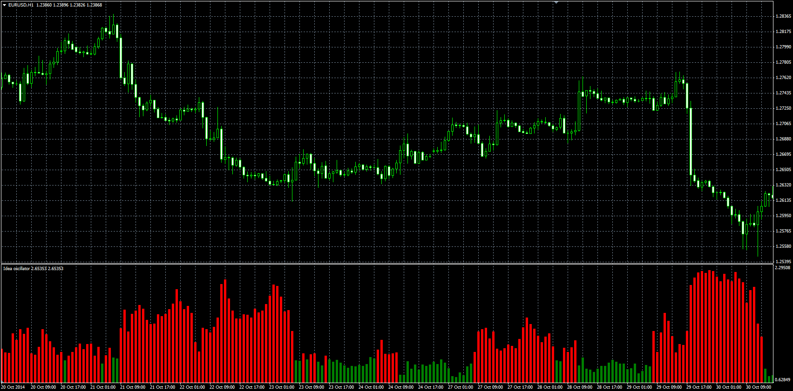

# Idea Trend oscillator

> Source: https://fxcodebase.com/code/viewtopic.php?f=38&t=61518  
> Forum: 38 · Topic 61518 · 1 post(s)

---

## Idea Trend oscillator

**Alexander.Gettinger** · Fri Nov 21, 2014 5:05 pm

Original LUA oscillator: [viewtopic.php?f=17&t=4739](https://fxcodebase.com/code/viewtopic.php?f=17&t=4739).

Formulas:
Idea = (MA_H-MA_C)/(MA_C-MA_L), where
MA_H = MA(High) with [Length] number of periods and [Method] type,
MA_L = MA(Low) with [Length] number of periods and [Method] type,
MA_C = MA(Close) with [Length] number of periods and [Method] type.

 

Download:

 [Idea.mq4](files/97290/Idea.mq4)
