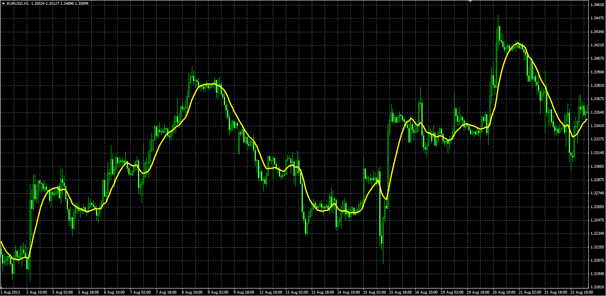

# IE/2 moving average

> Source: https://fxcodebase.com/code/viewtopic.php?f=38&t=59964  
> Forum: 38 · Topic 59964 · 1 post(s)

---

## IE/2 moving average

**Alexander.Gettinger** · Mon Nov 25, 2013 2:37 pm

IE/2 - Combination of LSMA ([viewtopic.php?f=38&t=59628&p=89910](https://fxcodebase.com/code/viewtopic.php?f=38&t=59628&p=89910)) and ILRS([viewtopic.php?f=38&t=59963](https://fxcodebase.com/code/viewtopic.php?f=38&t=59963)).
IE/2=(ILRS+LSMA)/2.

 

Download:

 [IE2_MA.mq4](files/91098/IE2_MA.mq4)
