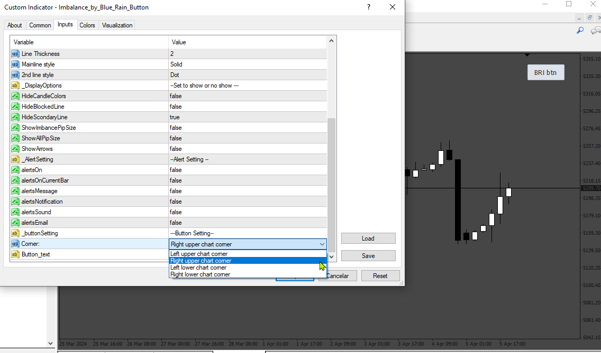

# Imbalance_by_Blue_Rain_Button

> Source: https://fxcodebase.com/code/viewtopic.php?f=38&t=74764  
> Forum: 38 · Topic 74764 · 3 post(s)

---

## Imbalance_by_Blue_Rain_Button

**Apprentice** · Mon Apr 08, 2024 4:13 am

Based on the request.
[https://fxcodebase.com/code/viewtopic.php?f=27&t=74744](https://fxcodebase.com/code/viewtopic.php?f=27&t=74744)

 [Imbalance_by_Blue_Rain_Button.mq4](files/154961/Imbalance_by_Blue_Rain_Button.mq4)

---

## Re: Imbalance_by_Blue_Rain_Button

**nablito** · Tue Apr 09, 2024 2:45 am

Thanks, it works perfectly, but there is a problem. When I choose for example RIGHT_LOWER_CORNER and there is a separate window of another indicator, the button is covered. Is it possible to make it so that if I increase or decrease the height of the separate window of the other indicator, the button is not hidden but "follows" maintaining the altered distances?

Let me explain: if I choose RIGHT_LOWER as the corner and the button has a distance x: 100 and y: 100 from the corner, by inserting a new window the distances must remain unchanged.

Alternatively, perhaps it is simpler, I propose to eliminate the use of CButton from the code and put the classic inputs of the buttons that already exist.

Thank you

---

## Re: Imbalance_by_Blue_Rain_Button

**Apprentice** · Tue Apr 16, 2024 3:08 am

Try this version.

 [Imbalance_by_Blue_Rain_Button.mq4](files/155033/Imbalance_by_Blue_Rain_Button.mq4)
