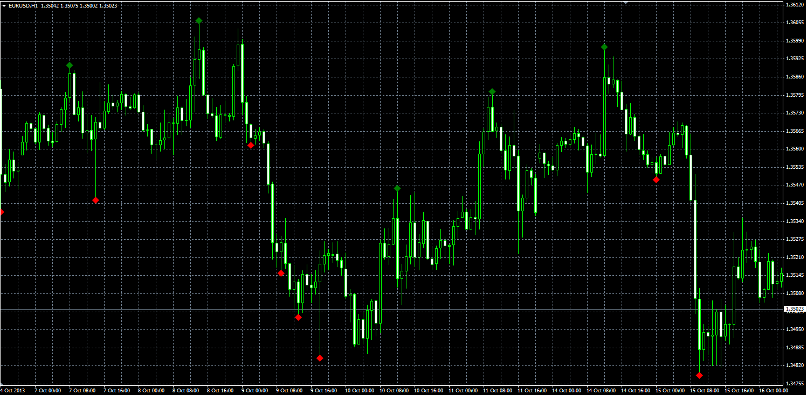

# Important extremum indicator

> Source: https://fxcodebase.com/code/viewtopic.php?f=38&t=59988  
> Forum: 38 · Topic 59988 · 1 post(s)

---

## Important extremum indicator

**Alexander.Gettinger** · Tue Nov 26, 2013 4:11 pm

Formulas:
"Up", if High[i-1]>=MaxHigh and High[i-1]>High[i],
"Dn", if Low[i-1]<=MinLow and Low[i-1]<Low[i], where
MaxHigh, MinLow - maximum and minimum prices at range from (i-Period-1) to (i-2).

 

Download:

 [Important_Extremums.mq4](files/91143/Important_Extremums.mq4)
