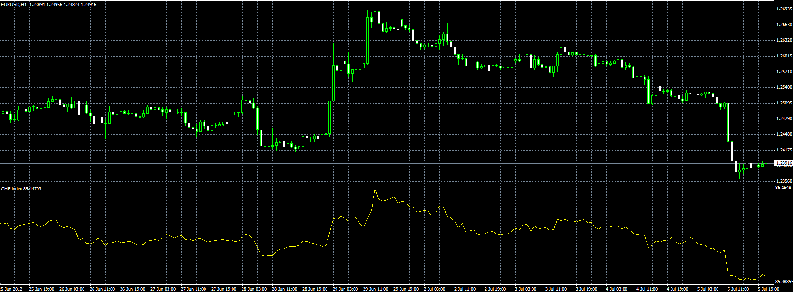
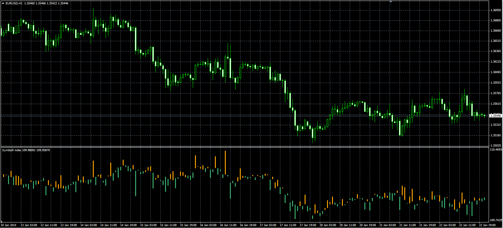

# Indexes of currency

> Source: https://fxcodebase.com/code/viewtopic.php?f=38&t=20874  
> Forum: 38 · Topic 20874 · 2 post(s)

---

## Indexes of currency

**Alexander.Gettinger** · Thu Jul 05, 2012 4:50 pm

Original indicator: [viewtopic.php?f=17&t=2379](https://fxcodebase.com/code/viewtopic.php?f=17&t=2379)

The indicator calculates the indexes of currency using the index of US dollar ([viewtopic.php?f=38&t=20873](https://fxcodebase.com/code/viewtopic.php?f=38&t=20873)).

For example:
Index of EUR calculate as [EUR/USD] * USDX
Index of CHF calculate as USDX / [USD/CHF].

 

Download:

 [SymbolX.mq4](files/36561/SymbolX.mq4)

---

## Re: Indexes of currency

**Alexander.Gettinger** · Wed Jan 22, 2014 4:59 pm

SymbolX candle indicator.

 

Download:

 [SymbolX_Candle.mq4](files/92219/SymbolX_Candle.mq4)

The indicator draws only the open and close prices, the high and low prices to be determined.
