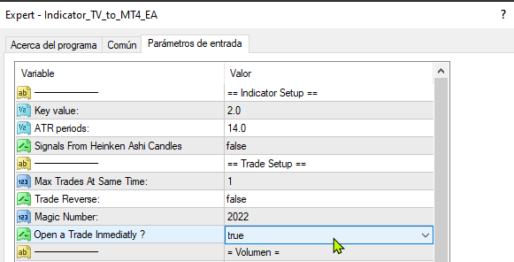
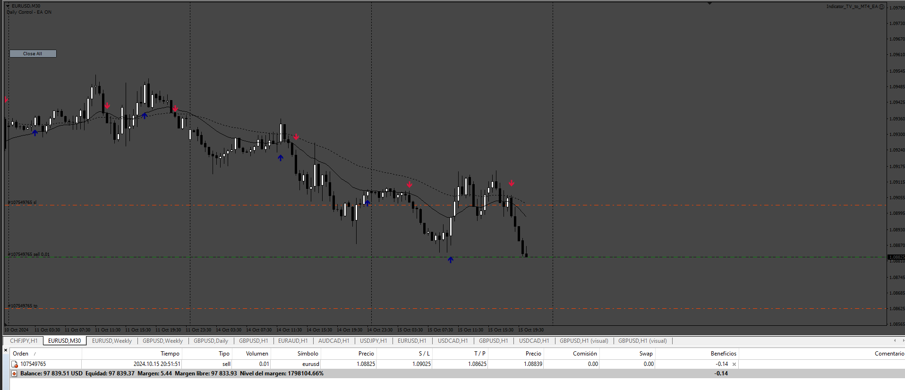
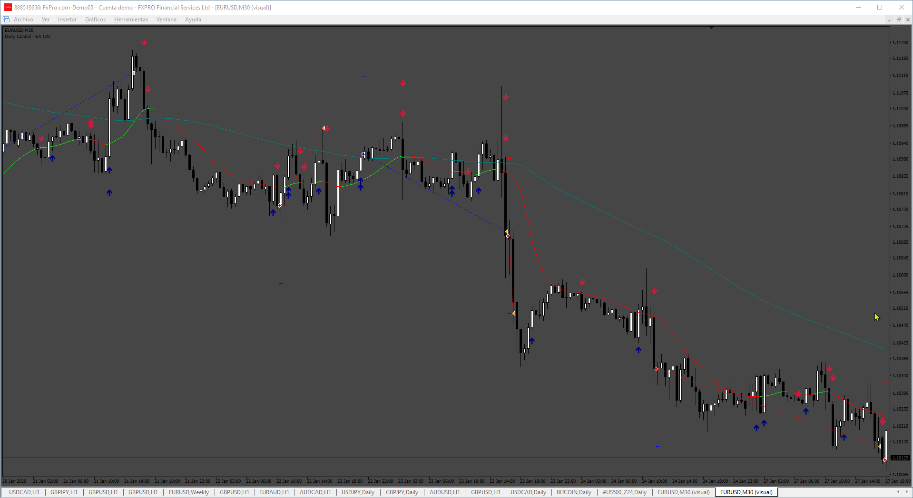
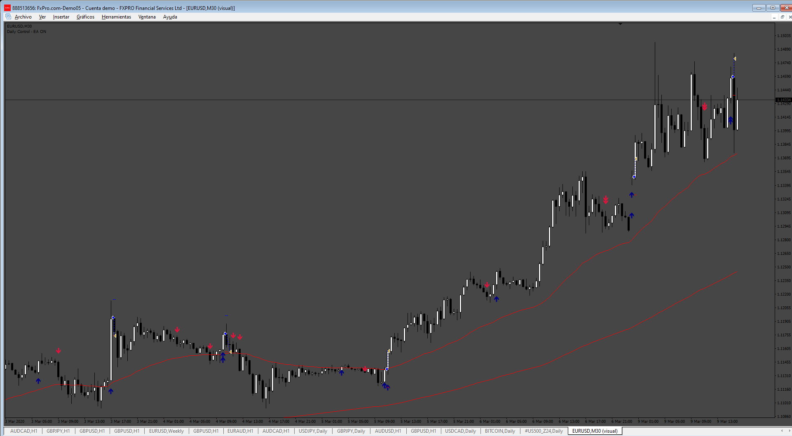

# Indicator_TV_to_MT4_EA_instant

> Source: https://fxcodebase.com/code/viewtopic.php?f=38&t=75288  
> Forum: 38 · Topic 75288 · 13 post(s)

---

## Indicator_TV_to_MT4_EA_instant

**Apprentice** · Thu Oct 17, 2024 6:30 pm

 

Based on the request.
[https://fxcodebase.com/code/viewtopic.php?f=38&t=75264](https://fxcodebase.com/code/viewtopic.php?f=38&t=75264)

 [Indicador_TV_to_MT4.mq4](files/157022/Indicador_TV_to_MT4.mq4)

 [Indicator_TV_to_MT4_EA_instant.mq4](files/157022/Indicator_TV_to_MT4_EA_instant.mq4)

---

## Re: Indicator_TV_to_MT4_EA_instant

**Appu264** · Wed Oct 23, 2024 2:41 pm

Please fillter EA with this ai Trend indicator
For avoiding marked false trade show in this photo
Trade fillter by two indicator

if KNN CLASSIFIER LINE GREEN AND BUY UP ARROW IS SHOW then OPEN BUY TRADE instant
if KNN CLASSIFIER LINE RED AND SELL DOWN ARROW IS SHOW then OPEN SELL TRADE instant
 CLOSE on opposite by two indicator (true and false)
Please add if equity profit reached limit close all trade first then close meta traders (true and false)
Please if possible add break even by money amount or pips
Distance (true and false)

---

## Re: Indicator_TV_to_MT4_EA_instant

**Apprentice** · Thu Oct 31, 2024 8:47 am

We have added your request to the development list.
Development reference 821

---

## Re: Indicator_TV_to_MT4_EA_instant

**Appu264** · Sat Nov 02, 2024 6:05 am

Please add this

With condition if auto trading is enabled then
OPEN TRADE( ANY TIME)IF NO TRADE RUN ON CHART (ANY TIME)
And auto trading enabled on local time (true or false)
And
CLOSE all trade before disable auto trading (true or false)
auto trading disable by equity profit reached amount (true or false)

---

## Re: Indicator_TV_to_MT4_EA_instant

**topntown** · Sat Nov 02, 2024 10:12 am

Please add THIS EA CODE IN Indicator_TV_to_MT4_EA_instant EA
OTHER WISE
ADD APPLY TEMPLATE FunctionON THIS Indicator_TV_to_MT4_EA_instant
And template apply on local time and
If equity profit reached amount/ equity take profit then disable auto trading
Close all trade before disable auto trading

---

## Re: Indicator_TV_to_MT4_EA_instant

**Satya264** · Wed Nov 06, 2024 3:51 am

make new version
MAKE A EA AS MTF
TRADE ENTRY AS M1 TO H4 TIME FRAME (INSTANT) IF NO TRADE RUN ON CHART THEN OPEN TRADE INSTANT
TRADE CLOSE AS M5 TO H4 TIME FRAME
CLSOE ON OPPSITE SAME AS M1 TO H4 TIME FRAME

---

## Re: Indicator_TV_to_MT4_EA_instant

**Apprentice** · Wed Nov 06, 2024 2:46 pm

We have added your request to the development list.
Development reference 833

---

## Re: Indicator_TV_to_MT4_EA_instant

**trtrader** · Wed Nov 06, 2024 9:12 pm

Could you please add EMA filter?

When EMA 50 above EMA 200 = Allow only buy
When EMA 50 below EMA 200 = Allow only sell

Please make sure EMA numbers are in EA inputs so we can change if needed.

---

## Re: Indicator_TV_to_MT4_EA_instant

**bijay264** · Mon Nov 18, 2024 5:53 am

ADD A EXPIRE DATE ON ANY EA IN MQL4 CODE
OR LICENCE OR CONTROL VIA REMOTELY

---

## Re: Indicator_TV_to_MT4_EA_instant

**Apprentice** · Fri Nov 22, 2024 1:12 pm

We have added your request to the development list.
Development reference 862

---

## Re: Indicator_TV_to_MT4_EA_instant

**Apprentice** · Sun Nov 24, 2024 5:25 am

 [Indicator_TV_to_MT4_EA_instant_filter.mq4](files/157337/Indicator_TV_to_MT4_EA_instant_filter.mq4)

---

## Re: Indicator_TV_to_MT4_EA_instant

**Apprentice** · Sun Nov 24, 2024 5:39 am

 [Indicator_TV_to_MT4_EA_instant_EMAS_Filter.mq4](files/157342/Indicator_TV_to_MT4_EA_instant_EMAS_Filter.mq4)

---

## Re: Indicator_TV_to_MT4_EA_instant

**Apprentice** · Mon Feb 24, 2025 5:57 am

[Indicator_TV_to_MT4_EA_MTF.mq4](files/158383/Indicator_TV_to_MT4_EA_MTF.mq4)

Task 833
