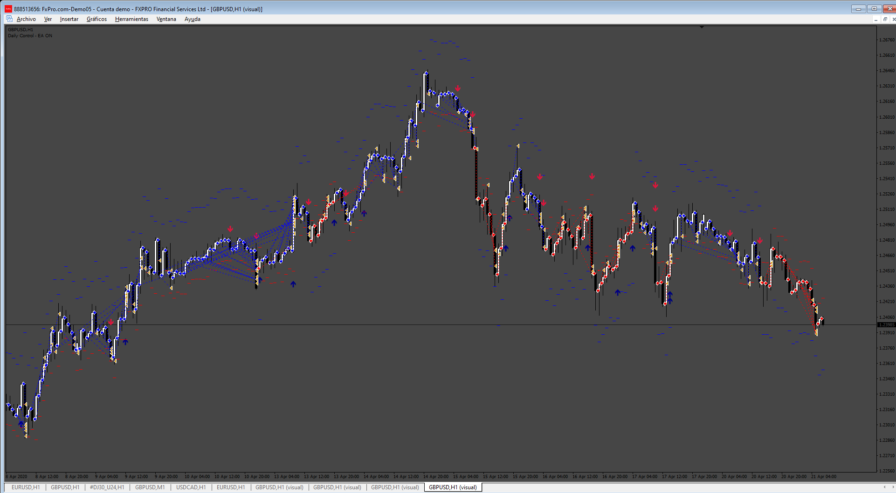
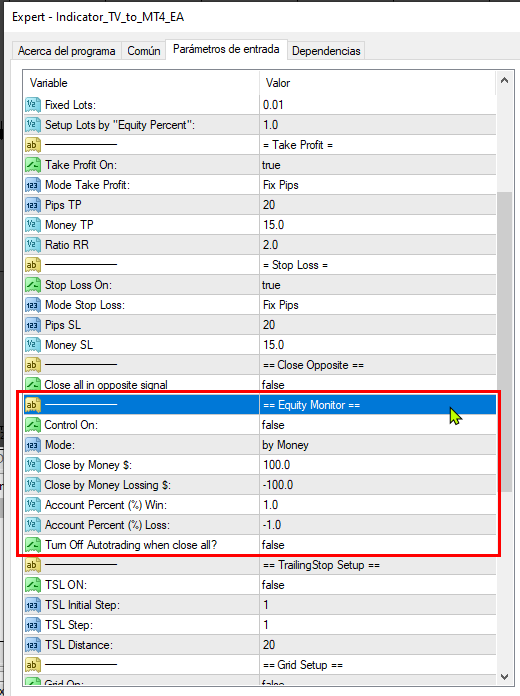

# Indicator_TV_to_MT4_EA

> Source: https://fxcodebase.com/code/viewtopic.php?f=38&t=75133  
> Forum: 38 · Topic 75133 · 8 post(s)

---

## Indicator_TV_to_MT4_EA

**Apprentice** · Mon Aug 12, 2024 2:41 pm

 

Based on the request.
[https://fxcodebase.com/code/viewtopic.php?f=38&t=75120](https://fxcodebase.com/code/viewtopic.php?f=38&t=75120)

 [Indicador_TV_to_MT4.mq4](files/156404/Indicador_TV_to_MT4.mq4)

 [Indicator_TV_to_MT4_EA_v2.mq4](files/156404/Indicator_TV_to_MT4_EA_v2.mq4)

---

## Re: Indicator_TV_to_MT4_EA

**Satya264** · Tue Aug 13, 2024 5:59 am

open trade immediately on current signal of indicator IF BUY THEN OPEN BUY TRADE
IF SELL THEN OPEN SELL TRADE immediately WHEN attach EA IN CHART

otherwise
 signal of indicator if buy then buy trade open as new candle till next signal
signal of indicator if sell then sell trade open as new candle till next signal

otherwise
 signal of indicator if buy then open trade every green candle till next signal
signal of indicator if sell then sell open as every red candle till next signal

---

## Re: Indicator_TV_to_MT4_EA

**Apprentice** · Thu Aug 15, 2024 5:36 am

We have added your request to the development list.
Development reference 653

---

## Re: Indicator_TV_to_MT4_EA

**Apprentice** · Fri Aug 16, 2024 5:01 pm

 [Indicator_TV_to_MT4_EA_v2.mq4](files/156445/Indicator_TV_to_MT4_EA_v2.mq4)

---

## Re: Indicator_TV_to_MT4_EA

**Satya264** · Sun Aug 18, 2024 11:38 pm

EA CAN'T TAKE ANY TRADE NOT BUY OR SELL

PLEASE SEE AT PHOTO

---

## Re: Indicator_TV_to_MT4_EA

**bijay264** · Sun Aug 18, 2024 11:50 pm

MY OLD EA WORKING AS GOOD BUT AFTER NEW UPDATE EA IS NOT WORK PLEASE FIX IT THIS EA WORK AS NEW UPDATE LIKE TAKE TRADE EVERY CANDLE

---

## Re: Indicator_TV_to_MT4_EA

**Apprentice** · Wed Aug 21, 2024 4:28 pm

We have added your request to the development list.
Development reference 662

---

## Re: Indicator_TV_to_MT4_EA

**Apprentice** · Sun Jul 13, 2025 1:44 pm

[Indicator_TV_to_MT4_EA_v3.mq4](files/159907/Indicator_TV_to_MT4_EA_v3.mq4)

Try this version.
