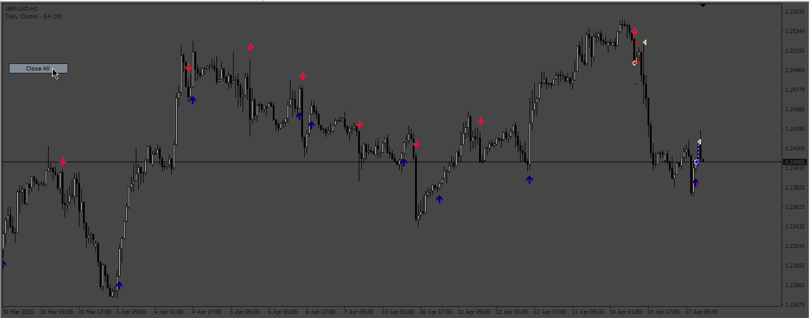
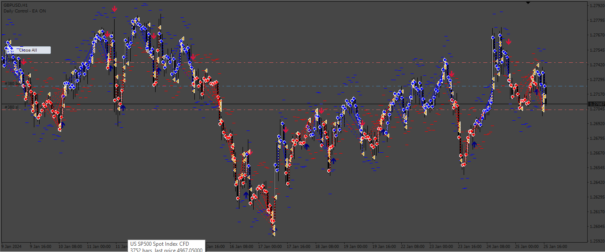
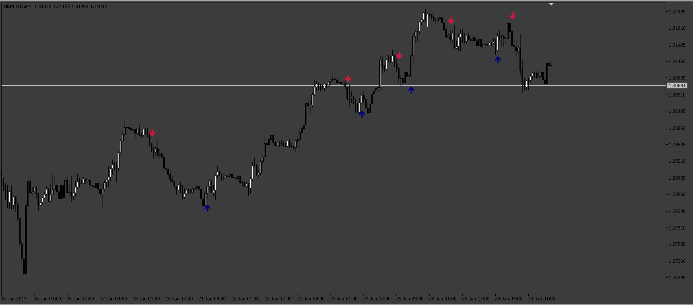
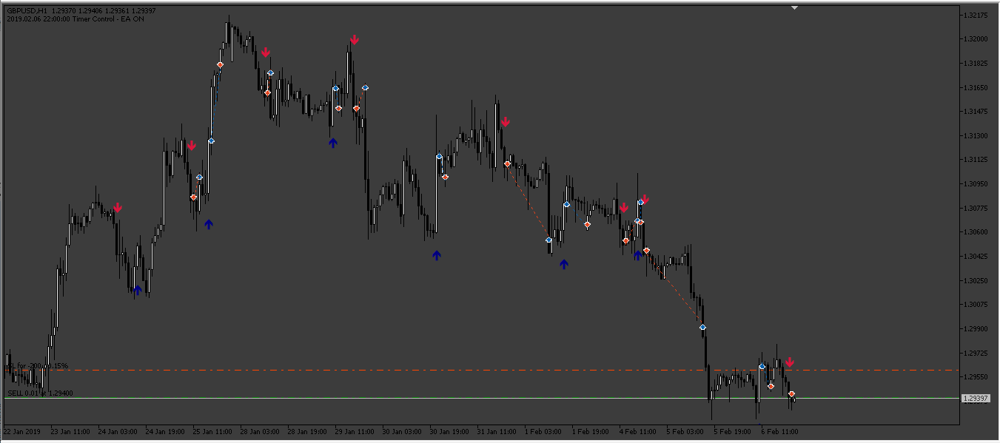
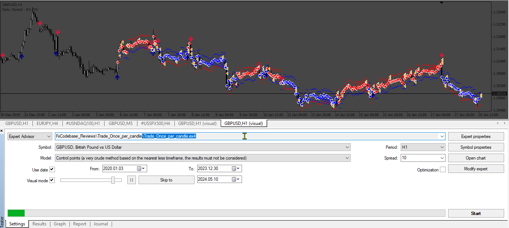
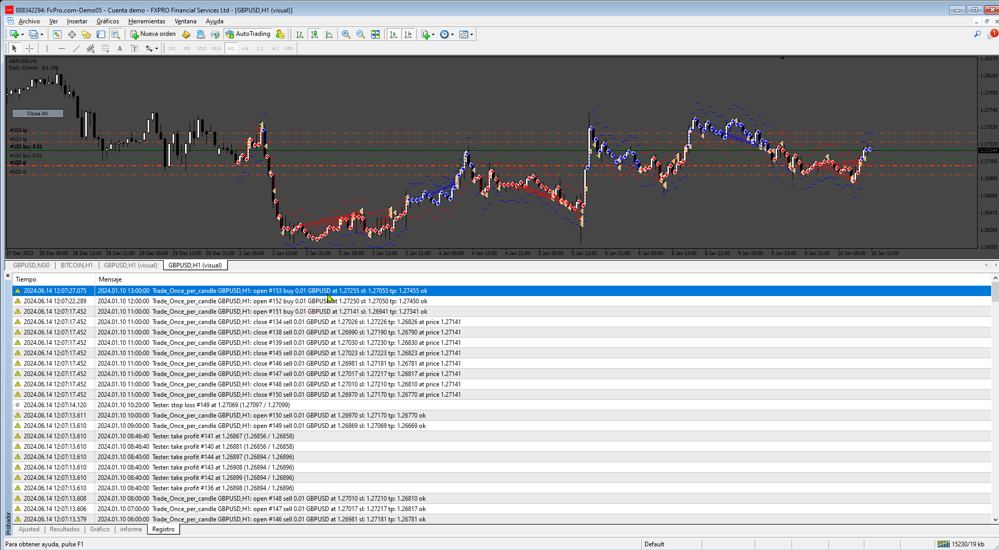
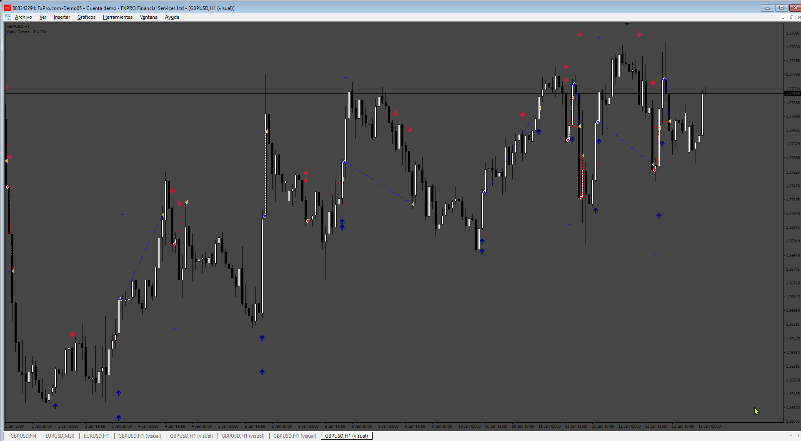

# Indicator_TV_to_MT4 EA

> Source: https://fxcodebase.com/code/viewtopic.php?f=38&t=74071  
> Forum: 38 · Topic 74071 · 28 post(s)

---

## Indicator_TV_to_MT4 EA

**Apprentice** · Fri Aug 25, 2023 2:12 am



Based on the request.
[https://fxcodebase.com/code/viewtopic.p ... 49#p152149](https://fxcodebase.com/code/viewtopic.php?f=27&p=152149#p152149)

 [Indicador_TV_to_MT4.mq4](files/152229/Indicador_TV_to_MT4.mq4)

 [Indicator_TV_to_MT4_EA.mq4](files/152229/Indicator_TV_to_MT4_EA.mq4)

---

## Re: Indicator_TV_to_MT4 EA

**Appu264** · Fri Aug 25, 2023 5:05 am

Sir it's not working as condition
And not taking any trade as per indicator signal

---

## Re: Indicator_TV_to_MT4 EA

**Apprentice** · Mon Aug 28, 2023 4:31 am

We have added your request to the development list.
Development reference 771.

---

## Re: Indicator_TV_to_MT4 EA

**Apprentice** · Fri Sep 01, 2023 2:21 pm

Try it now.

---

## Re: Indicator_TV_to_MT4 EA

**Appu264** · Fri Sep 01, 2023 2:59 pm

sorry sir but same condition no trade

---

## Re: Indicator_TV_to_MT4 EA

**dkatz51v** · Tue Nov 28, 2023 11:08 am

Hi, has there been any development or a fix on this EA? I have added both the Indicator_TV_to_MT4_EA.mq4 and Indicator_TV_to_MT4.mq4 to my chart. Both load fine but no trades are taken upon signal. Also when I turn on alerts on desktop on the EA, no alerts occur. When I turn it on, on the indicator, I get multiple alerts on the same 1 min candle. I believe I had upwards of 5 alerts during a 1 minute candle before I turned it off.
Also question, do I need the indicator active on the chart for the EA to enter and exit trades? I see that the indicator is required in the Indicators folder for the EA to load, but not sure if it needs to be active on the chart as the Key Value and ATR values are in both.

Thanks for your awesome work!

---

## Re: Indicator_TV_to_MT4 EA

**Apprentice** · Tue Dec 05, 2023 7:35 am

We have added your request to the development list.
Development reference 1085

---

## Re: Indicator_TV_to_MT4 EA

**dkatz51v** · Wed Dec 06, 2023 12:34 am

I see the issue with the indicator. In the journal it throws an error: array out of range in 'indicator_TV_to_MT4.mq4' (256,23). So, it doesn't load the indicator and no trades would be taken.

Thanks.

---

## Re: Indicator_TV_to_MT4 EA

**topntown** · Wed Apr 10, 2024 1:33 pm

Trade once per candle like UpTrend to buy per candle or DownTrend to sell per candle lot size tp sl and tsl customized like this EA
here is indicator and EA ATTACHMENT
Close all trade when the Trend is changed its automatically
Please add news fillter for news ALSO ACCOUNT protector
For account equity
CLOSE BY MONEY TURE AND FALSE

---

## Re: Indicator_TV_to_MT4 EA

**Apprentice** · Sun Apr 14, 2024 11:09 am

We have added your request to the development list.
Development reference 305

---

## Re: Indicator_TV_to_MT4 EA

**Apprentice** · Mon Apr 22, 2024 10:11 am



 [Trade_Once_per_candle.mq4](files/155081/Trade_Once_per_candle.mq4)

---

## Re: Indicator_TV_to_MT4 EA

**Appu264** · Tue Apr 23, 2024 12:48 am

just add trade per candle on this ea
buy trend to buy sell trend sell on this indicator base

---

## Re: Indicator_TV_to_MT4 EA

**Appu264** · Tue Apr 23, 2024 11:47 pm

make as indicator & EA MT5 VERSION

---

## Re: Indicator_TV_to_MT4 EA

**Apprentice** · Sat Apr 27, 2024 2:33 am

We have added your request to the development list.
Development reference 339

---

## Re: Indicator_TV_to_MT4 EA

**Apprentice** · Mon Apr 29, 2024 10:01 am



 



 [Indicador_TV_to_MT5.mq5](files/155186/Indicador_TV_to_MT5.mq5)

 [Indicator_TV_MT5_EA.mq5](files/155186/Indicator_TV_MT5_EA.mq5)

---

## Re: Indicator_TV_to_MT4 EA

**topntown** · Wed May 08, 2024 8:17 am

sir here is problem in this EA
Trade_Once_per_candle.mq4

2024.05.08 18:38:04.771	Trade_Once_per_candle: critical error on the pass 0

2024.05.08 18:38:04.771	Trade_Once_per_candle XAUUSDm,M5: invalid pointer access in 'Trade_Once_per_candle.mq4' (3039,38)

2024.05.08 18:38:04.607	TestGenerator: unmatched data error (low value 2300.95000 at 2024.05.02 20:35 is not reached from the least timeframe, low price 2301.31200 mismatches)

---

## Re: Indicator_TV_to_MT4 EA

**Apprentice** · Fri May 10, 2024 10:15 am


 [Trade_Once_per_candle.mq4](files/155313/Trade_Once_per_candle.mq4)

---

## Re: Indicator_TV_to_MT4 EA

**Apprentice** · Tue May 14, 2024 9:39 am



 [Trade_Once_per_candle.mq4](files/155342/Trade_Once_per_candle.mq4)

---

## Re: Indicator_TV_to_MT4 EA

**bijay264** · Tue Jun 04, 2024 5:34 am

MAKE THIS EA AND INDICATOR AS MTF
TRADE ENTRY AS 5MINS AND EXIT AS 1HRS

---

## Re: Indicator_TV_to_MT4 EA

**Apprentice** · Sat Jun 08, 2024 8:42 am

We have added your request to the development list.
Development reference 475

---

## Re: Indicator_TV_to_MT4 EA

**rickCreations** · Wed Jun 12, 2024 4:45 am

```
2024.06.12 17:44:46.843   2024.01.02 23:00:00  Trade_Once_per_candle GBPUSD,H1: OrderSend error 131
2024.06.12 17:44:46.752   2024.01.02 22:00:04  Trade_Once_per_candle GBPUSD,H1: OrderSend error 131
2024.06.12 17:44:46.671   2024.01.02 21:00:00  Trade_Once_per_candle GBPUSD,H1: OrderSend error 131
2024.06.12 17:44:46.615   2024.01.02 20:00:00  Trade_Once_per_candle GBPUSD,H1: OrderSend error 131
2024.06.12 17:44:46.513   2024.01.02 19:00:00  Trade_Once_per_candle GBPUSD,H1: OrderSend error 131
```

FIXLOT & Percent always give me order send error

---

## Re: Indicator_TV_to_MT4 EA

**rickCreations** · Wed Jun 12, 2024 4:47 am

```
2024.06.12 17:44:46.843   2024.01.02 23:00:00  Trade_Once_per_candle GBPUSD,H1: OrderSend error 131
2024.06.12 17:44:46.752   2024.01.02 22:00:04  Trade_Once_per_candle GBPUSD,H1: OrderSend error 131
2024.06.12 17:44:46.671   2024.01.02 21:00:00  Trade_Once_per_candle GBPUSD,H1: OrderSend error 131
2024.06.12 17:44:46.615   2024.01.02 20:00:00  Trade_Once_per_candle GBPUSD,H1: OrderSend error 131
2024.06.12 17:44:46.513   2024.01.02 19:00:00  Trade_Once_per_candle GBPUSD,H1: OrderSend error 131
```

I get this when fixed lot is set to 0.01 lots or percent is set to 1

if i change fixed lots to 0.1 then it works fine.. there is something wrong in the calculation.

---

## Re: Indicator_TV_to_MT4 EA

**Apprentice** · Wed Jun 12, 2024 3:01 pm

We have added your request to the development list.
Development reference 482

---

## Re: Indicator_TV_to_MT4 EA

**Apprentice** · Tue Jun 18, 2024 1:22 pm



---

## Re: Indicator_TV_to_MT4 EA

**trtrader** · Tue Jun 18, 2024 9:49 pm

This is actually UT bot and yes finally its exact copy of it. Could you please add to this version,

- Trailing start, distance, step.
- TP risk reward

---

## Re: Indicator_TV_to_MT4 EA

**Apprentice** · Sun Jun 23, 2024 3:47 pm

We have added your request to the development list.
Development reference 523

---

## Re: Indicator_TV_to_MT4 EA

**Apprentice** · Tue Jun 25, 2024 1:10 pm



 [Indicator_TV_to_MT4_EA.mq4](files/155923/Indicator_TV_to_MT4_EA.mq4)

---

## Re: Indicator_TV_to_MT4 EA

**Apprentice** · Mon Jul 21, 2025 4:42 am

[attachment=1]475.png[/attachment]
Task 475
[attachment=0]Trade_Once_per_candle_v2.mq4[/attachment]
