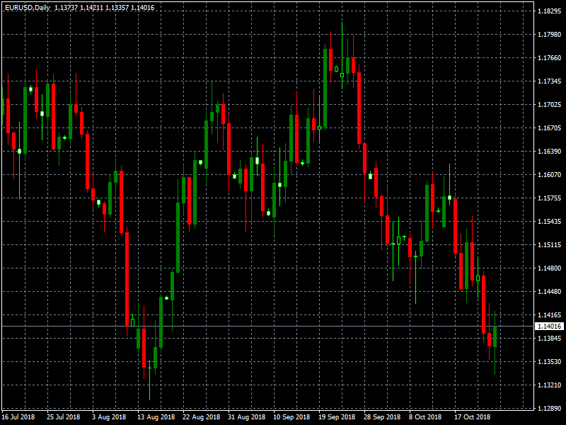

# Inertia_bars

> Source: https://fxcodebase.com/code/viewtopic.php?f=38&t=68457  
> Forum: 38 · Topic 68457 · 1 post(s)

---

## Inertia_bars

**Apprentice** · Mon May 13, 2019 5:15 am

Based on TS2/Lua indicator
[viewtopic.php?f=17&t=60367](https://fxcodebase.com/code/viewtopic.php?f=17&t=60367)

 [Inertia_bars.mq4](files/126309/Inertia_bars.mq4)
