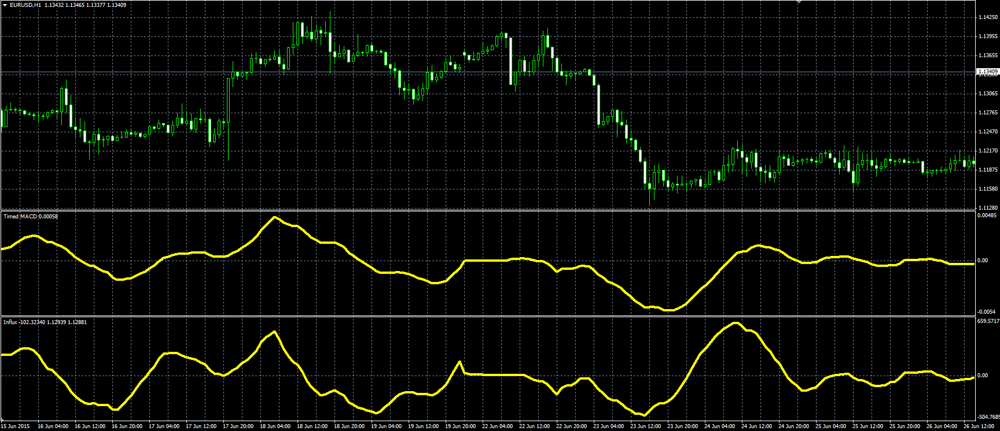

# Influx

> Source: https://fxcodebase.com/code/viewtopic.php?f=38&t=62647  
> Forum: 38 · Topic 62647 · 2 post(s)

---

## Influx

**Alexander.Gettinger** · Fri Sep 11, 2015 12:52 pm

Original LUA oscillators: [viewtopic.php?f=17&t=62160](https://fxcodebase.com/code/viewtopic.php?f=17&t=62160).

 

Download:

 [Influx.mq4](files/102298/Influx.mq4)

 [Timed_MACD.mq4](files/102298/Timed_MACD.mq4)

---

## Re: Influx

**ForexGuy** · Fri Apr 21, 2017 3:26 am

Is it possible to get a version in mq5 format of the above indicators please? Thanks!
