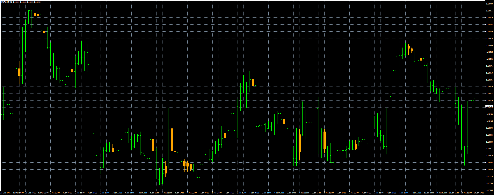
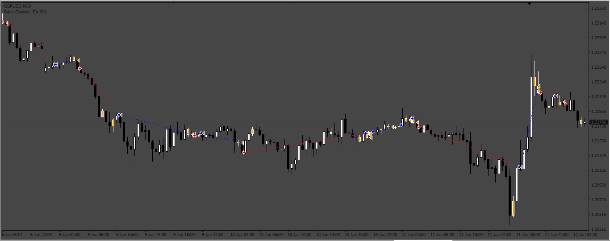

# Inside_Bar

> Source: https://fxcodebase.com/code/viewtopic.php?f=38&t=71974  
> Forum: 38 · Topic 71974 · 8 post(s)

---

## Inside_Bar

**Apprentice** · Wed Mar 16, 2022 11:46 am

Based on the request.
[https://fxcodebase.com/code/viewtopic.p ... 86#p144786](https://fxcodebase.com/code/viewtopic.php?f=27&p=144786#p144786)

 [Inside_Bar.mq4](files/145366/Inside_Bar.mq4)

 [Small_Inside_Bar.mq4](files/145366/Small_Inside_Bar.mq4)

 

 [InsideBar_EA.mq4](files/145366/InsideBar_EA.mq4)

---

## Re: Inside_Bar

**logicgate** · Fri Mar 25, 2022 5:46 am

Looks great, thanks buddy!

---

## Re: Inside_Bar

**logicgate** · Thu Mar 31, 2022 2:22 pm

Hi there buddy, can you remove the orange hard code?

Perhaps it´s better to leave the color adjustment for the colors tab.

I can see there are 4 fields there for color, I assume that two of them are for the countour? Problem is that even if we change the color there, when we close indicator settings it all reverses back to the single color.

I am not liking the candle being a single color, I wanted to add the black outline/contour to it, so it would also have black wicks.

Best regards

---

## Re: Inside_Bar

**Apprentice** · Fri Apr 01, 2022 2:52 am

Your request is added to the development list.
Development reference 192.

---

## Re: Inside_Bar

**Apprentice** · Wed Apr 06, 2022 5:56 am

[Inside_Bar_with_contour.mq4](files/145571/Inside_Bar_with_contour.mq4)

I can't remove the "hard code".
I had to figure out how can I draw the candle's outline with histogram buffer but resolved (arrow buffer doesn't work).

---

## Re: Inside_Bar

**crypto0014** · Wed Jan 18, 2023 12:23 pm

Pls turn this indicator into ea.

---

## Re: Inside_Bar

**Apprentice** · Fri Jan 20, 2023 11:42 am

We have added your request to the development list.
Development reference 54.

---

## Re: Inside_Bar

**Apprentice** · Mon Jan 23, 2023 10:41 am

InsideBar_EA.mq4 added.
