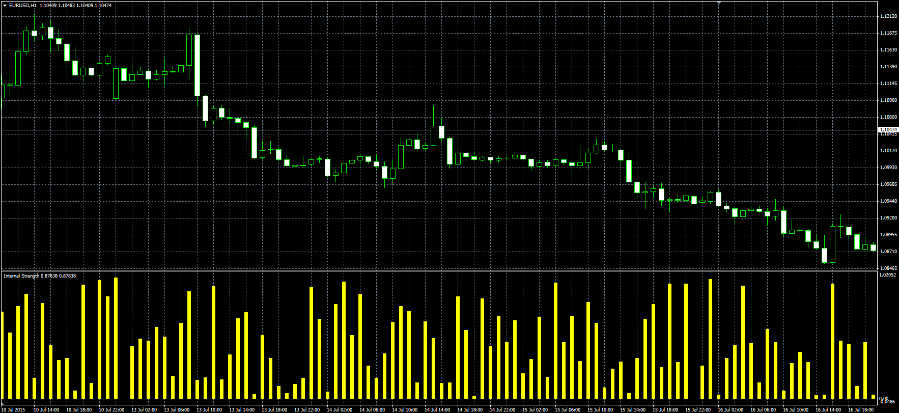

# Internal Strength

> Source: https://fxcodebase.com/code/viewtopic.php?f=38&t=62482  
> Forum: 38 · Topic 62482 · 1 post(s)

---

## Internal Strength

**Alexander.Gettinger** · Wed Jul 29, 2015 7:29 am

Original LUA oscillator: [viewtopic.php?f=17&t=62295](http://www.fxcodebase.com/code/viewtopic.php?f=17&t=62295).

Formula:
IS = RSI(Raw) with [RSI_Length] number of periods, where
Raw = (Close-Low)/(High-Low).

 

Download:

 [Internal_Strength.mq4](files/101585/Internal_Strength.mq4)
