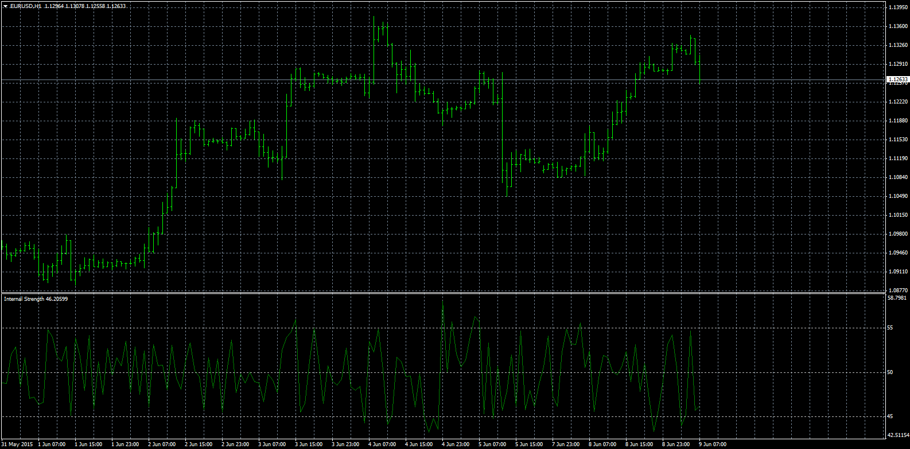

# Internal Strength

> Source: https://fxcodebase.com/code/viewtopic.php?f=38&t=62302  
> Forum: 38 · Topic 62302 · 1 post(s)

---

## Internal Strength

**Apprentice** · Tue Jun 09, 2015 3:18 am

Based on the template.
[viewtopic.php?f=17&t=62295](https://fxcodebase.com/code/viewtopic.php?f=17&t=62295)
Method 1
(close-low) / (high -low)
Method 2
RSI of Method 1

 [Internal Strength.mq4](files/100838/Internal%20Strength.mq4)
