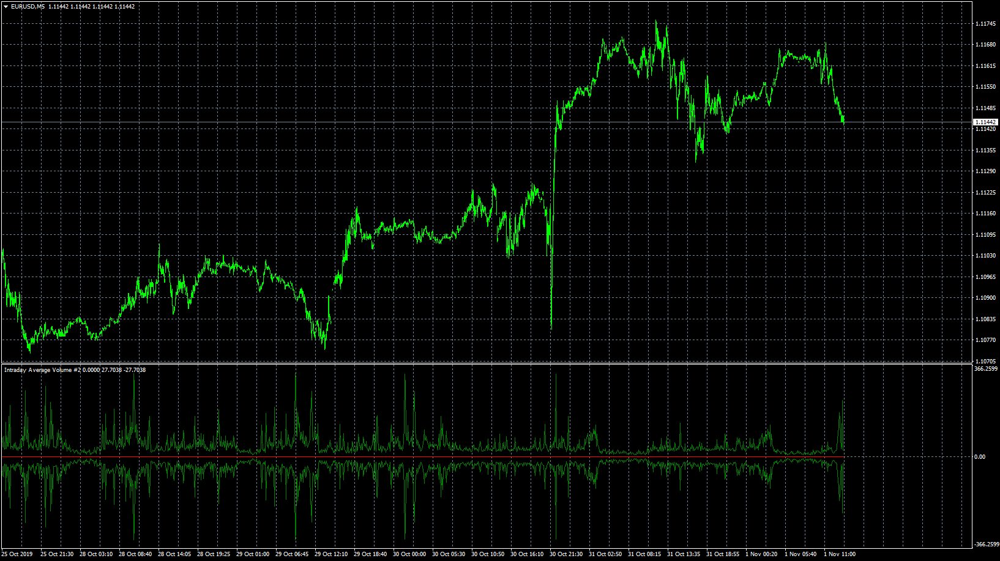
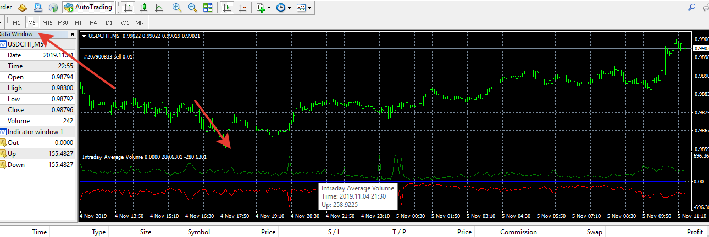

# Intraday_Average_Volume

> Source: https://fxcodebase.com/code/viewtopic.php?f=38&t=69080  
> Forum: 38 · Topic 69080 · 4 post(s)

---

## Intraday_Average_Volume

**Apprentice** · Fri Nov 01, 2019 7:35 am

Based on request.
[viewtopic.php?f=27&t=69068](https://fxcodebase.com/code/viewtopic.php?f=27&t=69068)

 [Intraday_Average_Volume.mq4](files/129526/Intraday_Average_Volume.mq4)

---

## Re: Intraday_Average_Volume

**richard19** · Mon Nov 04, 2019 11:06 am

Hi Apprentice,

This misbehaves at a lower time frame (5m) but works on 15m TF. Could you please have a look at it?

Thanks
Richard

---

## Re: Intraday_Average_Volume

**Apprentice** · Mon Nov 04, 2019 1:13 pm

Your request is added to the development list.
Development reference 276.

---

## Re: Intraday_Average_Volume

**Apprentice** · Tue Nov 05, 2019 6:25 am

I don't have any issues on m5
