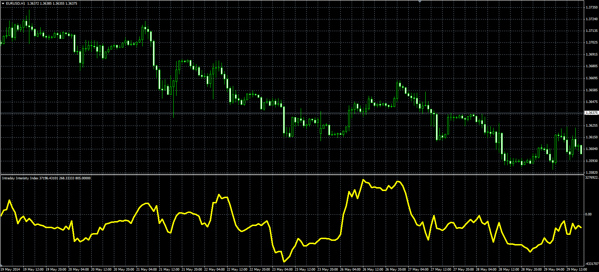

# Intraday Intensity Index

> Source: https://fxcodebase.com/code/viewtopic.php?f=38&t=60795  
> Forum: 38 · Topic 60795 · 1 post(s)

---

## Intraday Intensity Index

**Alexander.Gettinger** · Fri Jun 06, 2014 3:14 pm

Original LUA oscillator: [viewtopic.php?f=17&t=34513](https://fxcodebase.com/code/viewtopic.php?f=17&t=34513).

Formulas:
III = Sum of [Volume*(2*Close-High-Low)/(High-Low)] for Length bars without normalization or
III = 100*(Sum of [Volume*(2*Close-High-Low)/(High-Low)])/(Sum of [Volume]) for Length bars with normalization.

 

Download:

 [III.mq4](files/94371/III.mq4)
