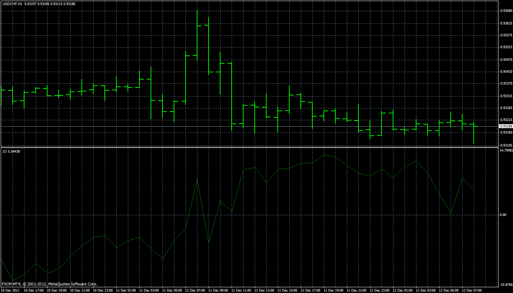

# Intraday Intensity Index

> Source: https://fxcodebase.com/code/viewtopic.php?f=38&t=34515  
> Forum: 38 · Topic 34515 · 1 post(s)

---

## Intraday Intensity Index

**Apprentice** · Fri Apr 12, 2013 6:52 am

[III.mq4](files/58806/III.mq4)

As described in article Intraday Intensity by Dennis Peterson
III = Sum ((2C-H-L)/(H-L))xV
Normalized III = (III /Sum(V))*100

 

