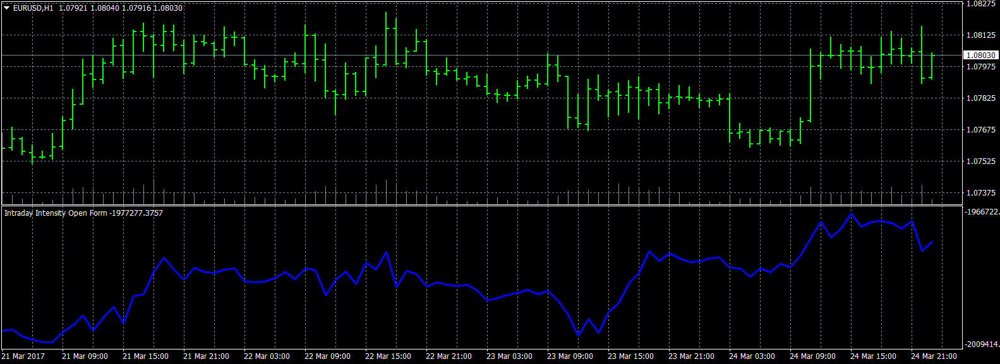

# Intraday Intensity Open Form

> Source: https://fxcodebase.com/code/viewtopic.php?f=38&t=64549  
> Forum: 38 · Topic 64549 · 1 post(s)

---

## Intraday Intensity Open Form

**Apprentice** · Sun Mar 26, 2017 7:22 am

Based on the Lua original.
[viewtopic.php?f=17&t=64544](https://fxcodebase.com/code/viewtopic.php?f=17&t=64544)
Intraday Intensity = ((2c-h-l)/(h-l)*v)
Intraday Intensity Open Form= Previous Intraday Intensity Open Form + Intraday Intensity

 [Intraday Intensity Open Form.mq4](files/111693/Intraday%20Intensity%20Open%20Form.mq4)
