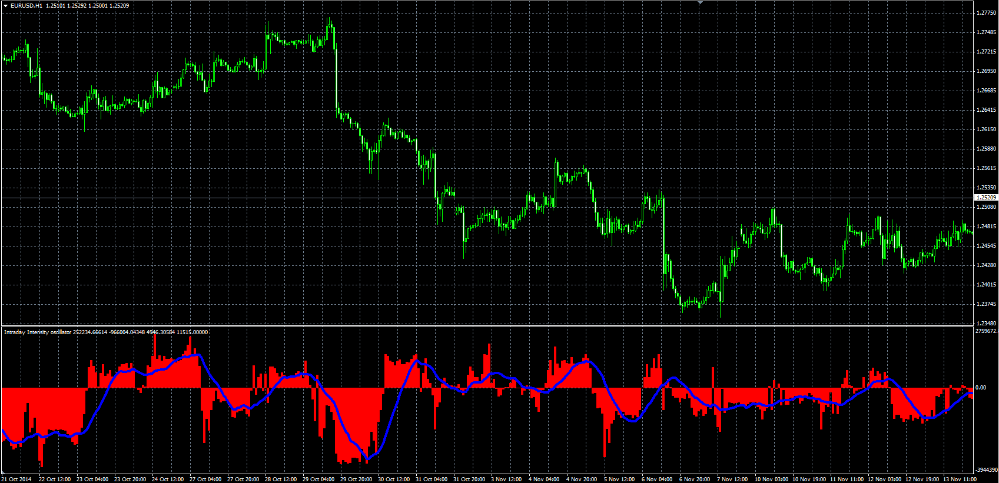

# Intraday Intensity

> Source: https://fxcodebase.com/code/viewtopic.php?f=38&t=61469  
> Forum: 38 · Topic 61469 · 1 post(s)

---

## Intraday Intensity

**Alexander.Gettinger** · Tue Nov 18, 2014 12:00 pm

Original LUA oscillator: [viewtopic.php?f=17&t=19120](https://fxcodebase.com/code/viewtopic.php?f=17&t=19120).

Formulas:
II = 100*Avg/AvgVol,
Signal = MVA(II) with [Smoothing_Length] number of periods, where
Avg = MVA(Volume*(2*Close-High-Low)/(High-Low)) with [Length] number of periods,
AvgVol = MVA(Volume) with [Length] number of periods.

 

Download:

 [III2.mq4](files/97164/III2.mq4)
