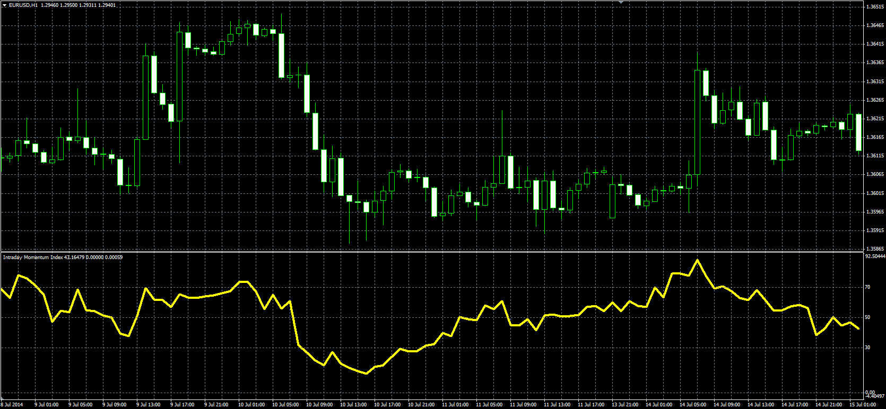

# Intraday Momentum Index

> Source: https://fxcodebase.com/code/viewtopic.php?f=38&t=61173  
> Forum: 38 · Topic 61173 · 1 post(s)

---

## Intraday Momentum Index

**Alexander.Gettinger** · Thu Sep 18, 2014 9:38 am

Original LUA oscillator: [viewtopic.php?f=17&t=30911](https://fxcodebase.com/code/viewtopic.php?f=17&t=30911).

Formula:
IMI = 100*U/(U+D), where
U = MVA(Up),
D = MVA(Down),
Up[i] = Close[i]-Open[i], if Close[i]>Open[i], else Up[i] = 0,
Down[i] = Open[i]-Close[i], if Close[i]<Open[i], else Down[i]=0.

 

Download:

 [IMI.mq4](files/95987/IMI.mq4)
