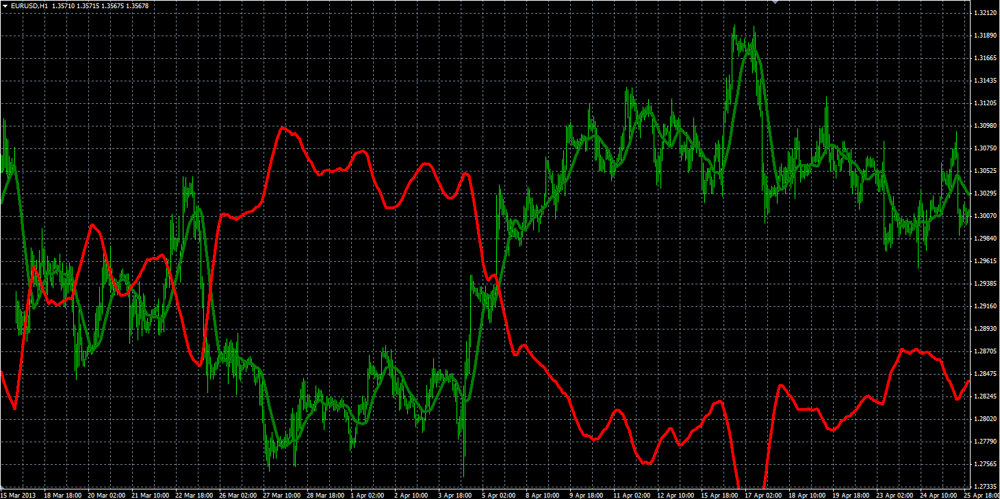
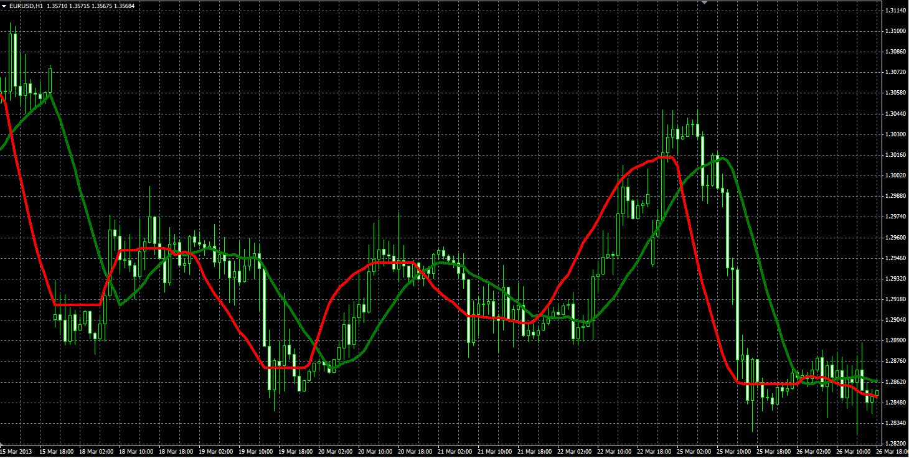
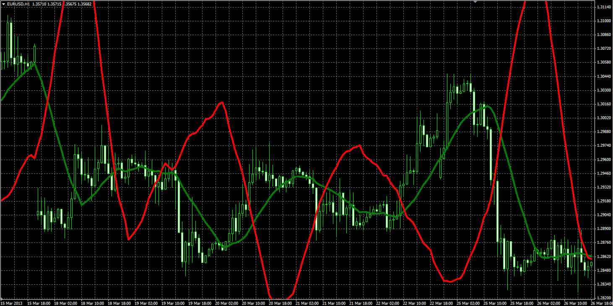
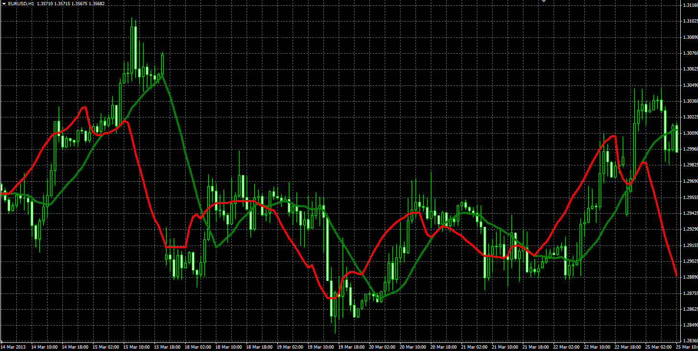

# Inverse MA indicator

> Source: https://fxcodebase.com/code/viewtopic.php?f=38&t=60022  
> Forum: 38 · Topic 60022 · 1 post(s)

---

## Inverse MA indicator

**Alexander.Gettinger** · Fri Nov 29, 2013 2:16 pm

Original LUA indicator: [viewtopic.php?f=17&t=33995&p=90515](https://fxcodebase.com/code/viewtopic.php?f=17&t=33995&p=90515).

 

 

 

 

Download:

 [IMA.mq4](files/91234/IMA.mq4)
