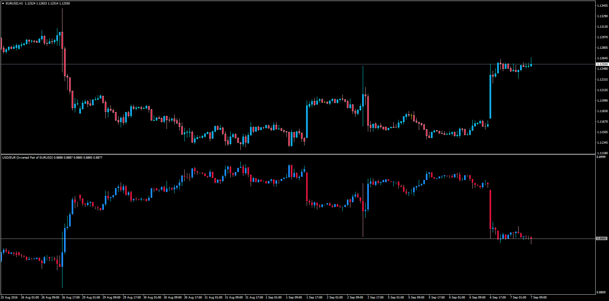
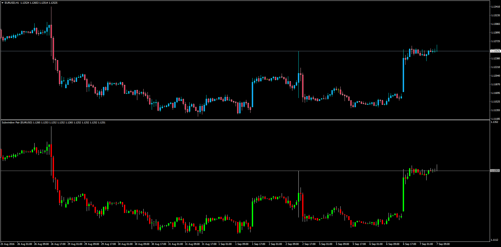

# Inverted_Pair

> Source: https://fxcodebase.com/code/viewtopic.php?f=38&t=63846  
> Forum: 38 · Topic 63846 · 1 post(s)

---

## Inverted_Pair

**Apprentice** · Thu Sep 08, 2016 7:02 am

Inverted pair of currencies

LUA Original: [viewtopic.php?f=17&t=1240](https://fxcodebase.com/code/viewtopic.php?f=17&t=1240)

Description:

This indicator mirrors the candlesticks from the Main Chart into a Subwindow with inverted prices, meaning that the EUR/USD becomes USD/EUR. It will serve as base for future projects using moving averages, arrows, clouds, trendlines, etc.
Also included comes the regular chart but using a subwindow instead of the main chart, in case there could be developed some applications in the future.

 [Inverted_Pair.mq4](files/108010/Inverted_Pair.mq4)

 

 [Subwindow_Pair.mq4](files/108010/Subwindow_Pair.mq4)
