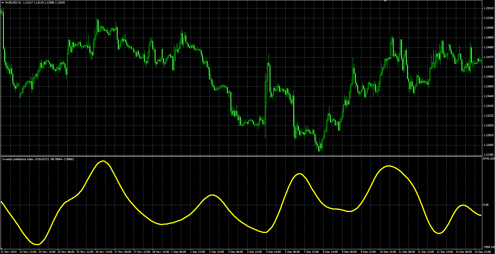

# Investor Preference Index

> Source: https://fxcodebase.com/code/viewtopic.php?f=38&t=61978  
> Forum: 38 · Topic 61978 · 1 post(s)

---

## Investor Preference Index

**Alexander.Gettinger** · Mon Mar 09, 2015 3:43 pm

Original LUA oscillator: [viewtopic.php?f=17&t=61405](https://fxcodebase.com/code/viewtopic.php?f=17&t=61405).

> This indicator was discussed in the December 1997 Technical Analysis of Stocks & Commodities magazine, page 19. The article was written by Cyril V. Smith Jr.
>
> Initially , This indicator, a long - term stock market investment tool, compared the performance of the S&P 500 to the New York Stock Exchange index to measure sentiment. The theory is that investors have a preference for certain types of investments.

 

Download:

 [Investor_Preference_Index.mq4](files/99133/Investor_Preference_Index.mq4)
