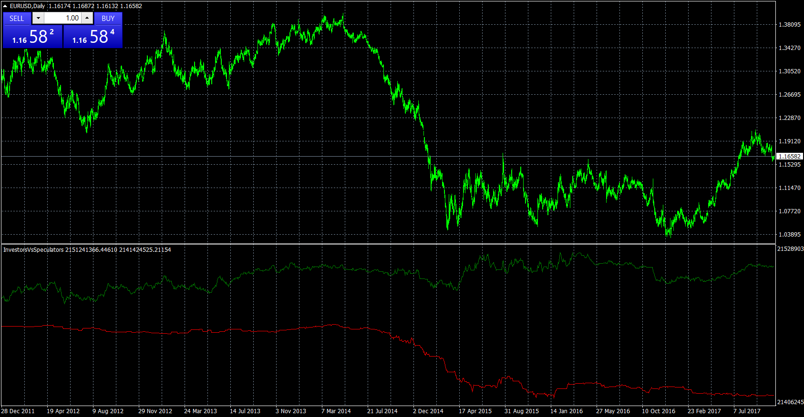
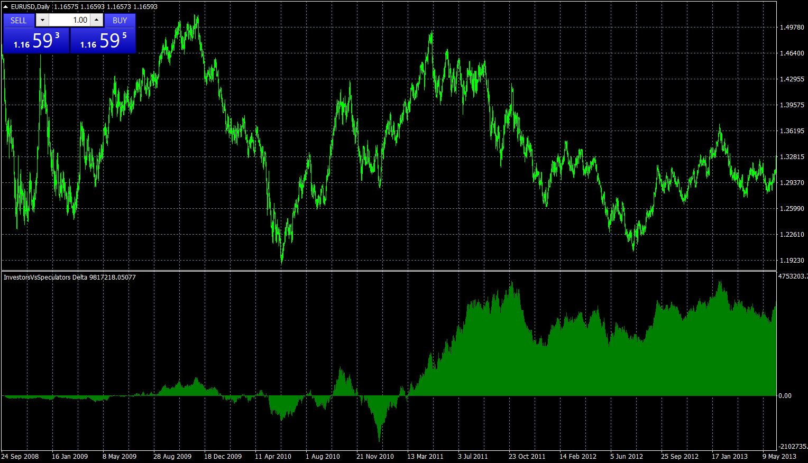
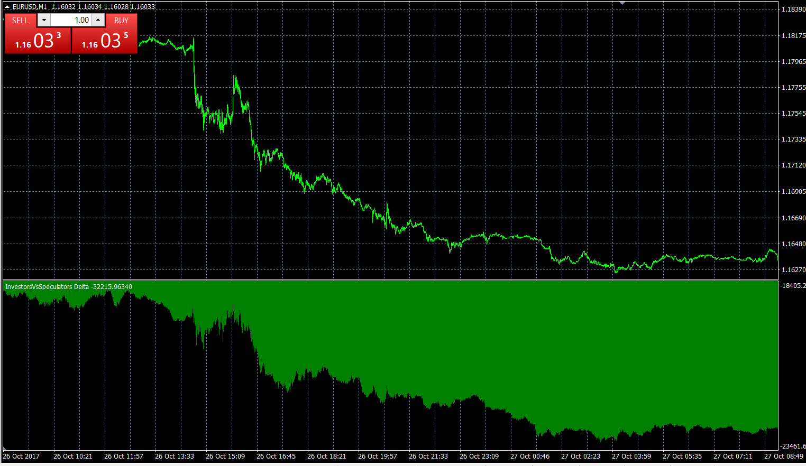

# InvestorsVsSpeculators

> Source: https://fxcodebase.com/code/viewtopic.php?f=38&t=65325  
> Forum: 38 · Topic 65325 · 6 post(s)

---

## InvestorsVsSpeculators

**Apprentice** · Thu Nov 02, 2017 5:52 pm

Based on the request.
[viewtopic.php?f=17&t=62294](https://fxcodebase.com/code/viewtopic.php?f=17&t=62294)

 [InvestorsVsSpeculators.mq4](files/115810/InvestorsVsSpeculators.mq4)

---

## InvestorsVsSpeculators Delta

**Apprentice** · Thu Nov 02, 2017 6:02 pm

 [InvestorsVsSpeculators Delta.mq4](files/115811/InvestorsVsSpeculators%20Delta.mq4)

---

## Re: InvestorsVsSpeculators

**Se7enTrader** · Sun Nov 05, 2017 5:16 pm

Thanks for the quick answer.
I see that InvestorsVsSpeculators only works for the higher timeframe (> D1) and I really can not understand why. I think about it. . . .

---

## Re: InvestorsVsSpeculators

**Apprentice** · Mon Nov 06, 2017 7:14 am

For me, it works at all time frames.

 

One minute Example.
Make sure you have logged in to your broker account.

---

## Re: InvestorsVsSpeculators

**Se7enTrader** · Tue Nov 07, 2017 4:39 am

I refer to the first indi (InvestorsVsSpeculators). You show me the second one (InvestorsVsSpeculators **Delta**)

---

## Re: InvestorsVsSpeculators

**Apprentice** · Thu Nov 09, 2017 5:22 am

For me, BOTH of them work on all time frames.
