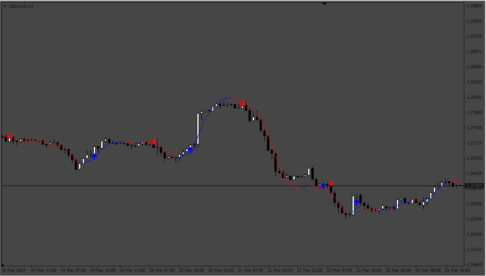
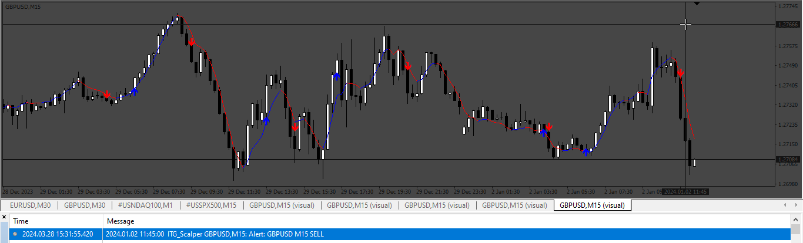
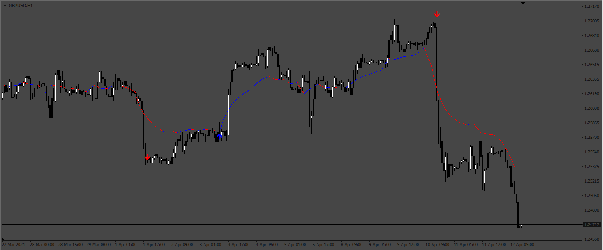

# ITG_Scalper

> Source: https://fxcodebase.com/code/viewtopic.php?f=38&t=74730  
> Forum: 38 · Topic 74730 · 7 post(s)

---

## ITG_Scalper

**Apprentice** · Mon Mar 25, 2024 5:34 pm

Based on TS2 original.
[https://fxcodebase.com/code/viewtopic.php?f=17&p=154734](https://fxcodebase.com/code/viewtopic.php?f=17&p=154734)

 [ITG_Scalper.mq4](files/154818/ITG_Scalper.mq4)

---

## Re: ITG_Scalper

**Dan19900** · Tue Mar 26, 2024 2:04 am

Thanks for the fast work, can MTF and current candle alert be added ?
A little thing i've noticed when i modify the settings and set them it takes a little bit to load on chart.
Seems it has a little bit of lag i think

---

## Re: ITG_Scalper

**Apprentice** · Wed Mar 27, 2024 10:02 am

We have added your request to the development list.
Development reference 259

---

## Re: ITG_Scalper

**Apprentice** · Sat Mar 30, 2024 5:30 pm

 [ITG_Scalper.mq4](files/154895/ITG_Scalper.mq4)

---

## Re: ITG_Scalper

**Dan19900** · Tue Apr 02, 2024 3:42 am

Hello again, i've seen this setting was not taken in consideration "can MTF and current candle alert be added ?" And i think some times it repaint, can this be also solved ?
Thanks in advance !

---

## Re: ITG_Scalper

**Apprentice** · Fri Apr 05, 2024 5:56 pm

We have added your request to the development list.
Development reference 287

---

## Re: ITG_Scalper

**Apprentice** · Tue Apr 16, 2024 5:09 am

 [ITG_Scalper_MTF.mq4](files/155043/ITG_Scalper_MTF.mq4)
