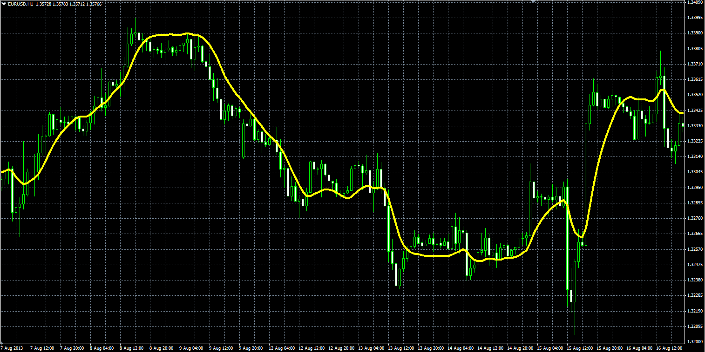

# ITrend moving average

> Source: https://fxcodebase.com/code/viewtopic.php?f=38&t=59635  
> Forum: 38 · Topic 59635 · 1 post(s)

---

## ITrend moving average

**Alexander.Gettinger** · Wed Oct 09, 2013 5:32 pm

Instantaneous Trendline by J.Ehlers.

Formulas:
ITrend[i] = (Price[i]+2*Price[i-1]+Price[i-2])/4 for i<=7,
ITrend[i] = c1*Price[i]+c2*Price[i-1]-c3*Price[i-2]+c4*ITrend[i-1]-c5*ITrend[i-2] for i>7, where
c1 = Alpha-0.25*Alpha*Alpha,
c2 = 0.5*Alpha*Alpha,
c3 = Alpha-0.75*Alpha*Alpha,
c4 = 2*(1-Alpha),
c5 = (1-Alpha)*(1-Alpha),
Alpha=2/(Length+1).

 

Download:

 [ITrendMA.mq4](files/89927/ITrendMA.mq4)

TS2/Marketscope/Lua version
