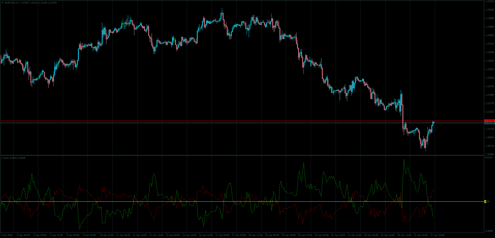

# iTrend

> Source: https://fxcodebase.com/code/viewtopic.php?f=38&t=65972  
> Forum: 38 · Topic 65972 · 1 post(s)

---

## iTrend

**Apprentice** · Mon Apr 30, 2018 4:59 pm

LUA Original: [viewtopic.php?f=17&t=3880](https://fxcodebase.com/code/viewtopic.php?f=17&t=3880)

Description:

This is the MT4 version of the LUA Origianl iTrend indicator.

The indicator has two components.
Sum of Bull and Bear Power.
Power[period] = -((High[period] - MA[period])+ (Low[period] - MA[period]));

Difference between price and selected component of Bollinger Bend.
Bollinger[period]= Price[period] - BANDS[Bollinger_Mode][period];

 [iTrend.mq4](files/118895/iTrend.mq4)
