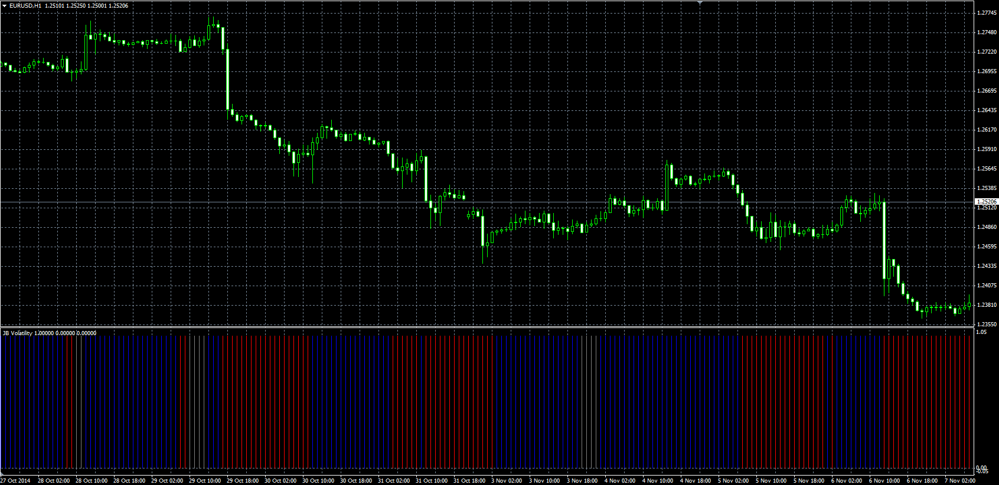

# JB Volatility

> Source: https://fxcodebase.com/code/viewtopic.php?f=38&t=61464  
> Forum: 38 · Topic 61464 · 1 post(s)

---

## JB Volatility

**Alexander.Gettinger** · Tue Nov 18, 2014 11:38 am

Original LUA oscillator: [viewtopic.php?f=17&t=20961](https://fxcodebase.com/code/viewtopic.php?f=17&t=20961).

> Higher Volatility
> closing price is greater than the lowest price of the previous 20 periods ,
> plus 10 period ATR multiplied by factor of 2 times
>
> Lower Volatility
> closing price is lower than the higest price of the previous 20 periods ,
> minus 10 period ATR multiplied by factor of 2 times

 

Download:

 [JB_Volatility.mq4](files/97154/JB_Volatility.mq4)
