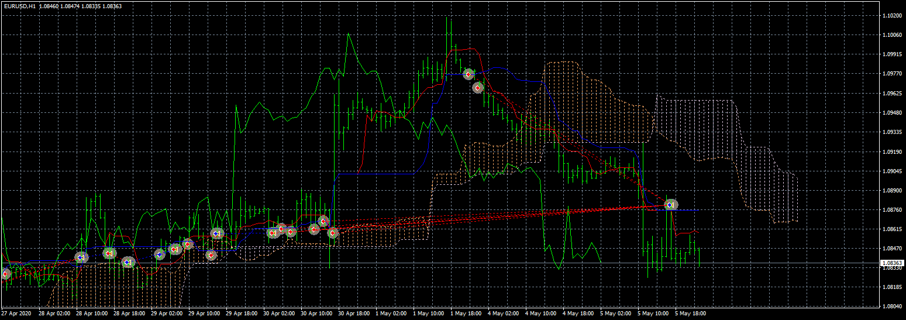

# Jjoetong EA

> Source: https://fxcodebase.com/code/viewtopic.php?f=38&t=70001  
> Forum: 38 · Topic 70001 · 3 post(s)

---

## Jjoetong EA

**Apprentice** · Thu Jun 11, 2020 6:00 am

Based on request.
[viewtopic.php?f=38&t=68827&start=30](https://fxcodebase.com/code/viewtopic.php?f=38&t=68827&start=30)

 [Jjoetong EA.mq4](files/134828/Jjoetong%20EA.mq4)

---

## Re: Jjoetong EA

**DIZUFX** · Sun Feb 21, 2021 11:45 pm

Hi Apprentice,
Can this EA trade with Gold and Bitcoin?
Thank you very much!

---

## Re: Jjoetong EA

**Apprentice** · Mon Feb 22, 2021 3:15 am

Sure.
If your broker has these instruments.
