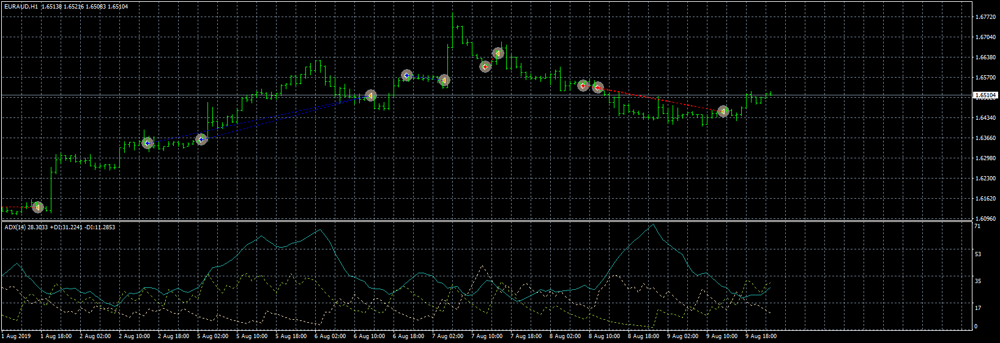

# Jozelu06_ADX_EA

> Source: https://fxcodebase.com/code/viewtopic.php?f=38&t=71212  
> Forum: 38 · Topic 71212 · 12 post(s)

---

## Jozelu06_ADX_EA

**Apprentice** · Thu May 20, 2021 10:17 am

Based on the request.
[https://fxcodebase.com/code/viewtopic.p ... 52#p142152](https://fxcodebase.com/code/viewtopic.php?f=27&p=142152#p142152)

 [Jozelu06_ADX_EA.mq4](files/142179/Jozelu06_ADX_EA.mq4)

---

## Re: Jozelu06_ADX_EA

**Jozelu06** · Thu May 20, 2021 2:09 pm

> **Apprentice wrote:**
>
>
> euraud-h1-fxcm-australia-pty.png
>
>
> Based on the request.
> [https://fxcodebase.com/code/viewtopic.p ... 52#p142152](https://fxcodebase.com/code/viewtopic.php?f=27&p=142152#p142152)
>
>
> Jozelu06_ADX_EA.mq4

Hello, thank you very much for your quick reply, but there are some errors:

It does not respect the maximum order of the day, the operations are closed with the opposite signal, even if it is removed

---

## Re: Jozelu06_ADX_EA

**Apprentice** · Fri May 21, 2021 4:45 am

Your request is added to the development list.
Development reference 500.

---

## Re: Jozelu06_ADX_EA

**Apprentice** · Fri May 21, 2021 9:25 am

I don't understand what that means. I need an example.

---

## Re: Jozelu06_ADX_EA

**Jozelu06** · Fri May 21, 2021 10:34 am

> **Apprentice wrote:**
> I don't understand what that means. I need an example.

When I say that it only makes one operation per day, or whatever, it does not respect it and takes all the signals that the adx gives, and also, if it has not closed the operation and the Adx line drops the level, it closes the operation, even having removed the section to close when the opposite signal

---

## Re: Jozelu06_ADX_EA

**Apprentice** · Tue May 25, 2021 3:55 am

Your request is added to the development list.
Development reference 508.

---

## Re: Jozelu06_ADX_EA

**Apprentice** · Thu May 27, 2021 11:31 am

Try this version.

 [Jozelu06_ADX_EA.mq4](files/142322/Jozelu06_ADX_EA.mq4)

I don't understand the part with closing operations

---

## Re: Jozelu06_ADX_EA

**puneet1979** · Tue Mar 26, 2024 12:29 am

> **Apprentice wrote:**
> Try this version.
>
>
> The attachment **Jozelu06_ADX_EA.mq4** is no longer available
>
>
> I don't understand the part with closing operations

Hi,

I have been trying different settings in the EA but I have a small request believe me I tried myself but could not do it so can you kindly put "Position Size and SL/TP setting from " EMA_STOCH_JEAW_EA_v1.00 " to "Jozelu06_ADX_EA" .
Here the files again if you have any trouble finding them
First is the screen shot of Position Size and SL/TP setting I am talking about

---

## Re: Jozelu06_ADX_EA

**Apprentice** · Wed Mar 27, 2024 10:03 am

We have added your request to the development list.
Development reference 260

---

## Re: Jozelu06_ADX_EA

**puneet1979** · Wed Apr 03, 2024 4:34 pm

> **Apprentice wrote:**
> We have added your request to the development list.
> Development reference 260

Hi,

Did you get any time to look into this ?

Thanks

---

## Re: Jozelu06_ADX_EA

**puneet1979** · Mon Aug 12, 2024 12:12 am

> **puneet1979 wrote:**
>
>
> > **Apprentice wrote:**
> > We have added your request to the development list.
> > Development reference 260
>
>
> Hi,
>
> Did you get any time to look into this ?
>
> Thanks

Hello,

Was your team able to do this.

Thanks

---

## Re: Jozelu06_ADX_EA

**Apprentice** · Mon Nov 24, 2025 2:02 pm

 [Jozelu06_ADX_EA_v1.00.mq4](files/161303/Jozelu06_ADX_EA_v1.00.mq4)
