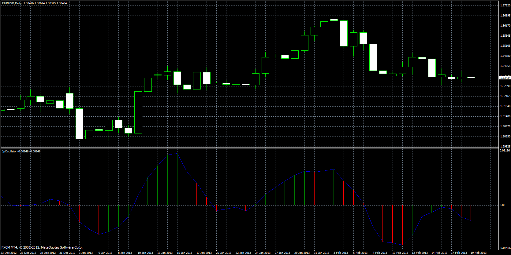

# JP Oscillator

> Source: https://fxcodebase.com/code/viewtopic.php?f=38&t=57203  
> Forum: 38 · Topic 57203 · 1 post(s)

---

## JP Oscillator

**Apprentice** · Sun Jul 28, 2013 6:45 am

JPO = MA of (source[period] - (source[period-1]/2 + source[period-2]/2)) - ( 0 - (source[period] - source[period-4]));

 [JpOscillator.mq4](files/85708/JpOscillator.mq4)
