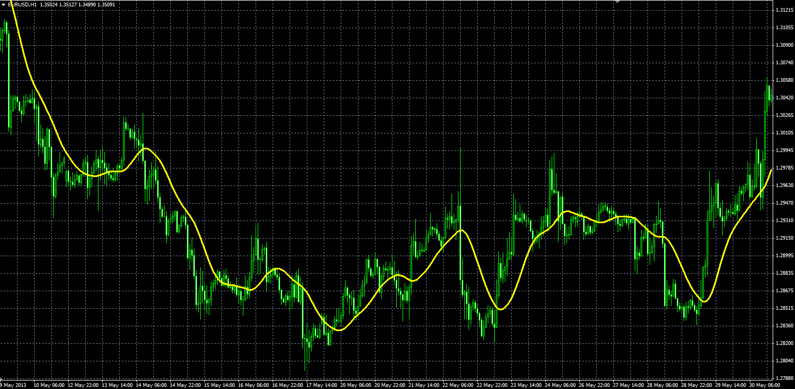

# JSmooth moving average

> Source: https://fxcodebase.com/code/viewtopic.php?f=38&t=59966  
> Forum: 38 · Topic 59966 · 1 post(s)

---

## JSmooth moving average

**Alexander.Gettinger** · Mon Nov 25, 2013 2:40 pm

JSmooth - Smoothing by Mark Jurik.

Formulas:
JSmooth[i]=J5[i], where
J5[i]=J5[i-1]+J4[i],
J4[i]=(J3[i]-J5[i-1])*(1-Alpha)*(1-Alpha)+J4[i-1]*Alpha*Alpha,
J3[i]=J1[i]+J2[i],
J2[i]=(Price[i]-J1[i])*(1-Alpha)+J2[i-1]*Alpha,
J1[i]=Price[i]*(1-Alpha)+J1[i-1]*Alpha,
Alpha=0.45*Length/(0.45*(Length-1)+2).

 

Download:

 [JSmooth_MA.mq4](files/91100/JSmooth_MA.mq4)
