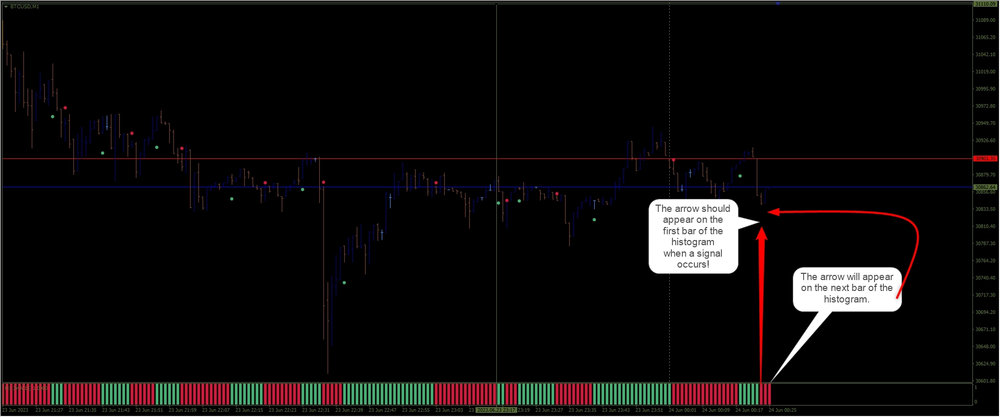

# Jurik_filter_HISTO_AA

> Source: https://fxcodebase.com/code/viewtopic.php?f=38&t=73862  
> Forum: 38 · Topic 73862 · 4 post(s)

---

## Jurik_filter_HISTO_AA

**Apprentice** · Fri Jun 23, 2023 3:57 am

Based on the request.
[https://fxcodebase.com/code/viewtopic.php?f=27&p=151281](https://fxcodebase.com/code/viewtopic.php?f=27&p=151281)

 [Jurik_filter_HISTO_AA.mq4](files/151383/Jurik_filter_HISTO_AA.mq4)

---

## Re: Jurik_filter_HISTO_AA

**R0b3rt** · Sat Jun 24, 2023 4:17 pm

Hello. Thank you for this indicator.
I am testing it, but the arrow appears with a delay. When a buy or sell signal appears on the histogram the arrow does not appear immediately, it appears on the fourth bar of the histogram.
I have described in more detail on the picture.
Can you fix it?
Thanks in advance.

 

---

## Re: Jurik_filter_HISTO_AA

**Apprentice** · Sat Jul 01, 2023 6:22 am

We have added your request to the development list.
Development reference 581.

---

## Re: Jurik_filter_HISTO_AA

**Apprentice** · Tue Jul 04, 2023 10:03 am

Try it now.
