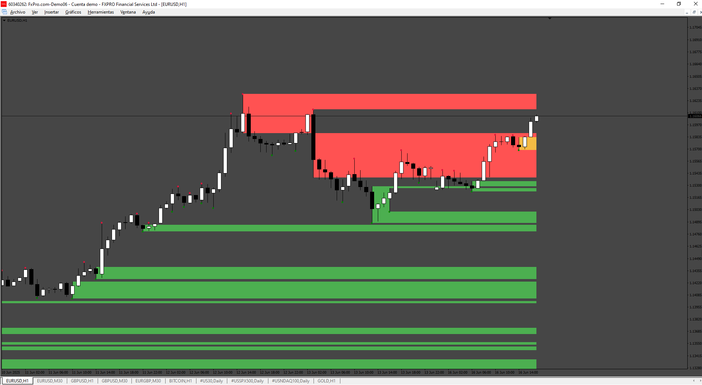
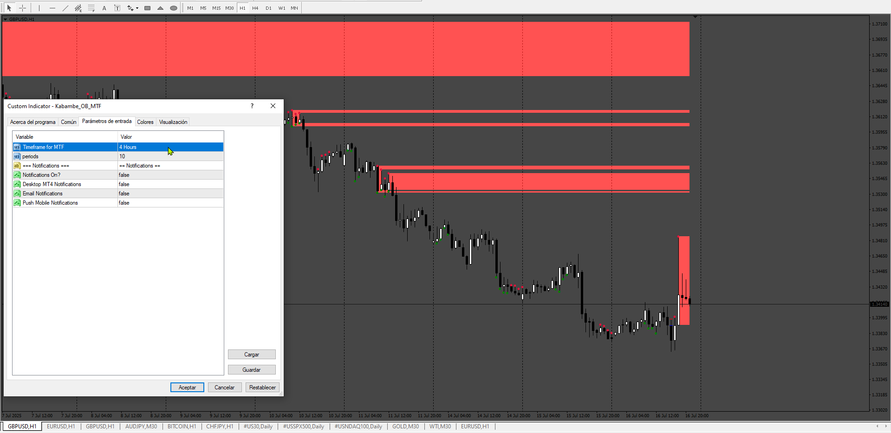
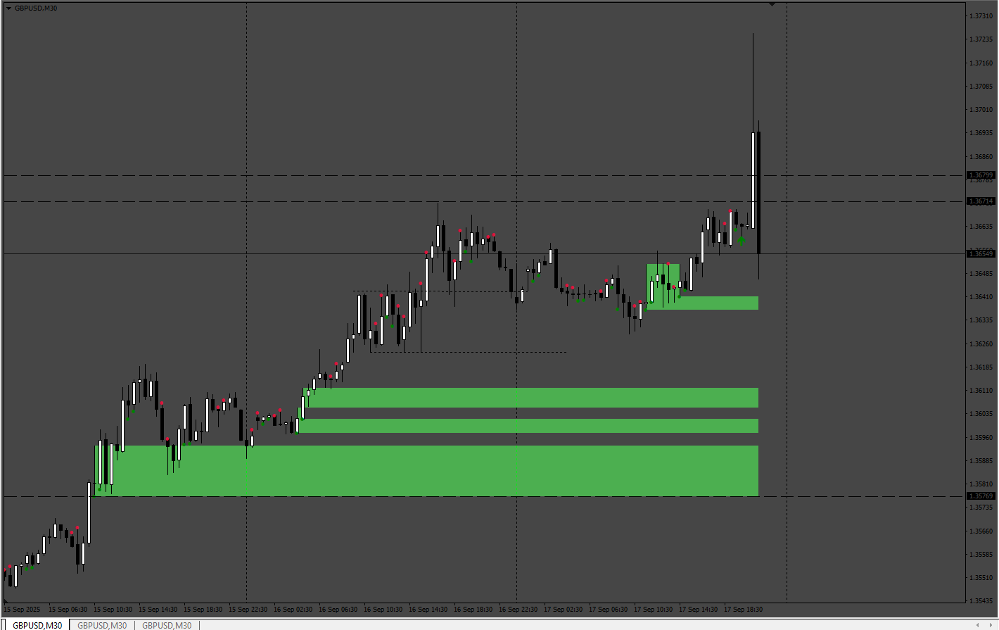

# Kabambe_OB

> Source: https://fxcodebase.com/code/viewtopic.php?f=38&t=76033  
> Forum: 38 · Topic 76033 · 7 post(s)

---

## Kabambe_OB

**Apprentice** · Tue Jun 17, 2025 6:28 am

Based on the request.
[https://fxcodebase.com/code/viewtopic.p ... 11#p159411](https://fxcodebase.com/code/viewtopic.php?f=27&p=159411#p159411)

 [Kabambe_OB.mq4](files/159603/Kabambe_OB.mq4)

---

## Re: Kabambe_OB

**YISSA75** · Mon Jun 23, 2025 8:52 am

Dear Admin/apprentice,
Do me a favour and add MTF buttons.. May God bless the works by your hands.

---

## Re: Kabambe_OB

**Apprentice** · Tue Jun 24, 2025 6:59 am

We have added your request to the development list.
Development reference 412

---

## Re: Kabambe_OB

**Apprentice** · Fri Jul 18, 2025 6:49 am

 [Kabambe_OB_MTF.mq4](files/159947/Kabambe_OB_MTF.mq4)

---

## Re: Kabambe_OB

**khanatd** · Tue Sep 16, 2025 8:00 pm

hi sir plz add arrows in it too. thnks, Be blessed always,

---

## Re: Kabambe_OB

**Apprentice** · Wed Sep 17, 2025 5:45 am

We have added your request to the development list.
Development reference 593

---

## Re: Kabambe_OB

**Apprentice** · Tue Sep 23, 2025 4:48 am

 [Kabambe_OB_MTF.mq4](files/160611/Kabambe_OB_MTF.mq4)
