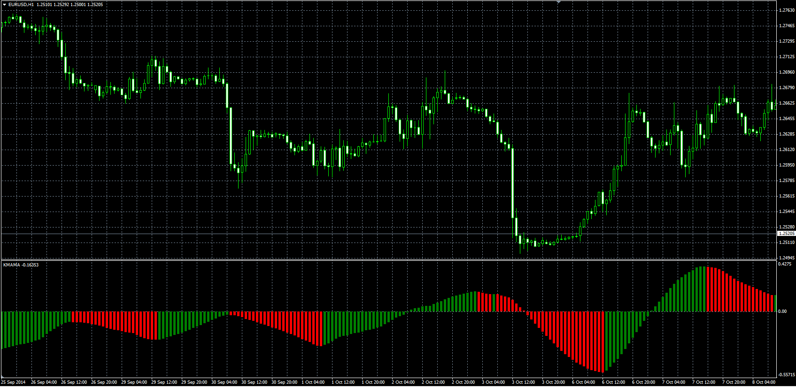

# Kairi (KMAMA)

> Source: https://fxcodebase.com/code/viewtopic.php?f=38&t=61474  
> Forum: 38 · Topic 61474 · 1 post(s)

---

## Kairi (KMAMA)

**Alexander.Gettinger** · Tue Nov 18, 2014 4:58 pm

Original LUA oscillator: [viewtopic.php?f=17&t=15310](https://fxcodebase.com/code/viewtopic.php?f=17&t=15310).

Formula:
KMAMA = 100*Short_MVA/Long_MVA-100, where
Short_MVA = MVA(Close price) with [Short_Length] number of periods,
Long_MVA = MVA(Close price) with [Long_Length] number of periods.

 

Download:

 [KMAMA.mq4](files/97176/KMAMA.mq4)
