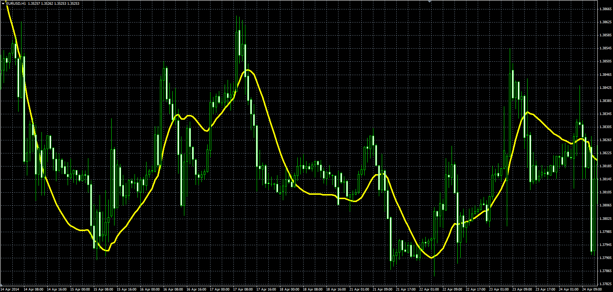

# Kalman filter

> Source: https://fxcodebase.com/code/viewtopic.php?f=38&t=60981  
> Forum: 38 · Topic 60981 · 1 post(s)

---

## Kalman filter

**Alexander.Gettinger** · Sun Jul 27, 2014 11:29 am

The indicator implements Kalman filter ([http://en.wikipedia.org/wiki/Kalman_filter](https://en.wikipedia.org/wiki/Kalman_filter))

Formulas:
Kalman[i]=Error+Velocity[i], where
Error=Kalman[i-1]+Distance*ShK,
Velocity[i]=Velocity[i-1]+Distance*K/100,
Distance=Price[i]-Kalman[i-1],
ShK=sqrt(Sharpness*K/100).

 

Download:

 [Kalman_Filter.mq4](files/95139/Kalman_Filter.mq4)
