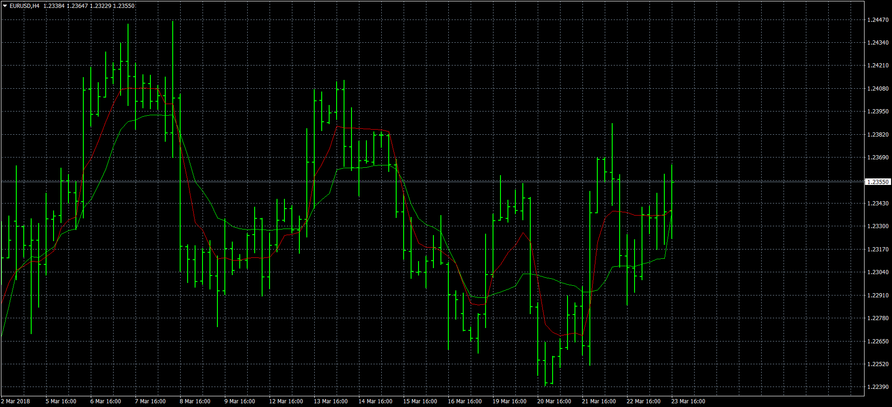

# KAMA and AMA

> Source: https://fxcodebase.com/code/viewtopic.php?f=38&t=65861  
> Forum: 38 · Topic 65861 · 2 post(s)

---

## KAMA and AMA

**Apprentice** · Fri Mar 23, 2018 1:22 pm

Base on TS2/Lua version.
[viewtopic.php?f=17&t=65860](https://fxcodebase.com/code/viewtopic.php?f=17&t=65860)

 [KAMA and AMA.mq4](files/118364/KAMA%20and%20AMA.mq4)

Based on an article Keeping Up With Changes - Adaptive Moving
Averages published by Vitali Apirine, March 2018 issue of the Stock and Commodities magazine.

---

## Re: KAMA and AMA

**bartwas1** · Fri Mar 23, 2018 7:28 pm

Hi Apprentice

Thank you. It was really fast.
