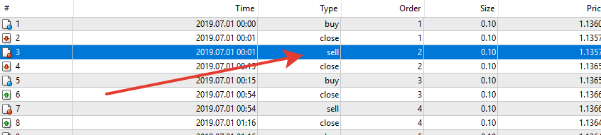

# KAMA_EA

> Source: https://fxcodebase.com/code/viewtopic.php?f=38&t=69138  
> Forum: 38 · Topic 69138 · 16 post(s)

---

## KAMA_EA

**Apprentice** · Mon Nov 18, 2019 7:06 am

Based on request.
[viewtopic.php?f=27&t=69125](https://fxcodebase.com/code/viewtopic.php?f=27&t=69125)

 [KAMA_EA.mq4](files/129813/KAMA_EA.mq4)

KAMA
[viewtopic.php?f=38&t=59962](https://fxcodebase.com/code/viewtopic.php?f=38&t=59962)

---

## Re: KAMA_EA

**EZB-Schmarotzer** · Thu Nov 21, 2019 7:24 pm

This EA doesn't open short trades.

Please fix it

---

## Re: KAMA_EA

**Apprentice** · Fri Nov 22, 2019 5:10 am

Your request is added to the development list.
Development reference 342.

---

## Re: KAMA_EA

**Apprentice** · Fri Nov 22, 2019 8:12 am

I don't have any issues with short trades.

---

## Re: KAMA_EA

**tupalupa777** · Sun Dec 29, 2019 3:51 pm

Hi, I like your EA. Can you add "MaxSpread" in the settings, do not open an order at a higher value than the one specified. As far as I understand there is a SMA period 22 built in, is it possible to change this period in the EA default settings.

---

## Re: KAMA_EA

**Apprentice** · Mon Dec 30, 2019 6:13 am

Your request is added to the development list.
Development reference 504.

---

## Re: KAMA_EA

**tupalupa777** · Mon Jan 06, 2020 3:50 pm

Thanks but the file does not open ..... I have two different terminals. Both, the new version does not start ...... The old version works on the account, no problem .... Please look at the new changes .... The idea of the strategy is good, it just wants to be supplemented with one more or two improvements .... I'll test it a month and share my ideas with you. The main problem is the false signals for entering and opening orders when the strength of the trend has decreased ........

---

## Re: KAMA_EA

**Apprentice** · Tue Jan 07, 2020 8:29 am

Your request is added to the development list.
Development reference 525.

---

## Re: KAMA_EA

**Apprentice** · Wed Jan 08, 2020 6:41 am

[KAMA_EA.mq4](files/130623/KAMA_EA.mq4)

Try this version.

---

## Re: KAMA_EA

**tupalupa777** · Wed Jan 08, 2020 1:40 pm

Very good, it works. If you try this strategy, with conservative settings, the TF H4 is the best result.

---

## Re: KAMA_EA

**tupalupa777** · Fri Jan 10, 2020 5:21 pm

Hi, I want to make some changes to this strategy.
 First .... replace SMA with LWMA.
Second ..... use indicator ....."!
 Koral" .... http: //fxcodebase.com/code/download/file.php? Id = 25673 from your site ,
 to confirm the direction of orders ....
 Third ... the idea is: If we have an order open for example ... "bay" ... and it is closed by ... "t.p." ... when the next candle is opened, if the indicator ....!
 Koral .... also shows ... .up .... copy the closed order .....
The same happens when the order is opened ... "sell"....
This should be an additional function .... ON / OFF .... the parameters of the indicator. ..."!
koral" .... "Rperiod and LSMA "..... to fit in the input parameters.
THIS is only if the order closes with profit.

---

## Re: KAMA_EA

**Apprentice** · Sat Jan 11, 2020 7:14 am

Your request is added to the development list.
Development reference 540.

---

## Re: KAMA_EA

**Apprentice** · Mon Jan 13, 2020 6:25 am

[KAMA_EA.mq4](files/130705/KAMA_EA.mq4)

these systems do not open any trades, at least at the default parameters.
And I don't understand the third part

---

## Re: KAMA_EA

**tupalupa777** · Sun Jan 19, 2020 3:20 pm

Hi .... I have made a lot of attempts in the tester and the real account. The strategy does not open deals in certain situations and the reason for this is a logical error in the code ..... Please make the following changes:
1. Short order "kama0 >= ma 0 ''
       Long order "kama0 <= ma 0"
2. Remove from the code ..... "Logic type Direct / Reversal" .... it blocks the strategy
3. I couldn't find a way to turn off the indicator ..... "! Coral" .... if it can be .. switched.. on and off.
You have implemented it as a separate system and I would like it to be a filter that ..... confirms or denies order opening.

---

## Re: KAMA_EA

**Apprentice** · Mon Jan 20, 2020 8:46 am

Your request is added to the development list.
Development reference 570.

---

## Re: KAMA_EA

**Apprentice** · Wed Jan 22, 2020 5:09 pm

[KAMA_EA.mq4](files/130854/KAMA_EA.mq4)

Try this version.
