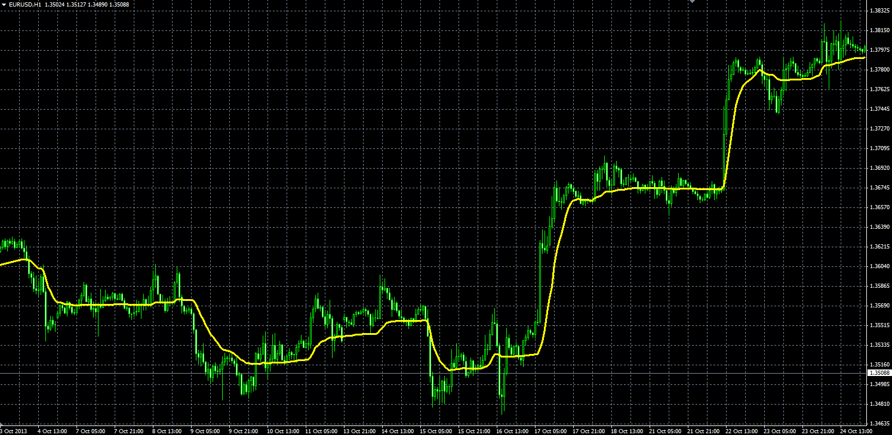

# Kaufman Adaptive moving average

> Source: https://fxcodebase.com/code/viewtopic.php?f=38&t=59962  
> Forum: 38 · Topic 59962 · 4 post(s)

---

## Kaufman Adaptive moving average

**Alexander.Gettinger** · Mon Nov 25, 2013 2:31 pm

Kaufman Adaptive Moving Average (KAMA) was created by Perry Kaufman and first presented in his book Smarter Trading (1995).

Formulas:
KAMA[i] = KAMA[i-1]+sc*(Price[i]-KAMA[i-1]), where
sc = (er*0.6015+0.0645)*(er*0.6015+0.0645),
er = Abs(Price[i]-Price[i-Length+1])/Sum1,
Sum1 = Sum(Abs(Price[i]-Price[i-1])) from (i-Length+1) to i.

 

Download:

 [KAMA.mq4](files/91096/KAMA.mq4)

---

## Re: Kaufman Adaptive moving average

**voodoopips** · Fri Jan 03, 2014 6:32 pm

I would like an alert for the cross of two Kama from two different time frames.

Must allow to choose different settings for the Kamas on different time frames.

Thank You.

---

## Re: Kaufman Adaptive moving average

**Apprentice** · Sun Jan 05, 2014 6:58 am

Your request is added to the development list.

---

## Re: Kaufman Adaptive moving average

**Alexander.Gettinger** · Tue Dec 18, 2018 6:44 pm

Please try this indicator:

 [Two_KAMA_Cross.mq4](files/122932/Two_KAMA_Cross.mq4)
