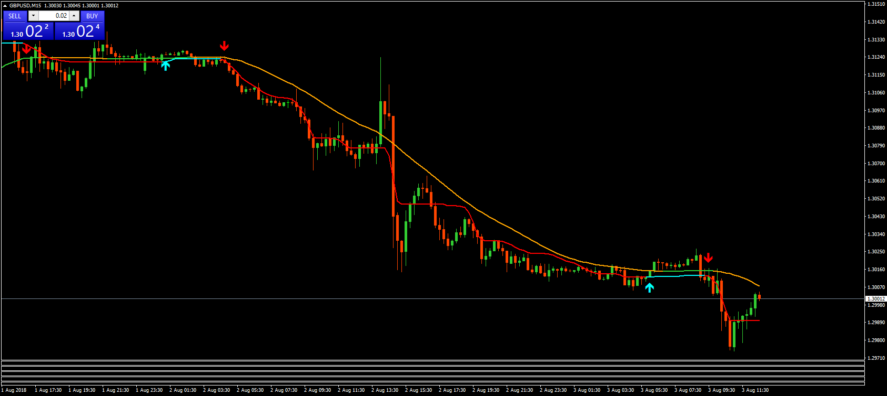

# Kaufman AMA averages filtered and CMA

> Source: https://fxcodebase.com/code/viewtopic.php?f=38&t=66422  
> Forum: 38 · Topic 66422 · 4 post(s)

---

## Kaufman AMA averages filtered and CMA

**bartwas1** · Fri Aug 03, 2018 6:40 am

Hi guys

I like how Kaufman AMA with higher time frame setting (in this case period is set at 6, the rest remains with no change) interprets the price. Then I found this indi called CMA by Vladradon. I have installed it on 15 m chart with Kaufman AMA. Both look like a sound idea.
CMA's arrows seems to give an early signal which compiled with a confirmation based on the other indicator leads to what looks like a good entry.

kind reg.
B.

 [kaufman ama averages filtered.mq4](files/120300/kaufman%20ama%20averages%20filtered.mq4)

 [CMA_2_CJCF+a.mq4](files/120300/CMA_2_CJCFa.mq4)

---

## Re: Kaufman AMA averages filtered and CMA

**Peteradshel** · Thu Aug 23, 2018 11:38 pm

Hi Apprentic
Can you add CMA arrow pop up alert and sound? Thanks !

---

## Re: Kaufman AMA averages filtered and CMA

**Apprentice** · Sat Aug 25, 2018 6:30 am

Your request is added to the development list under Id Number 4239

---

## Re: Kaufman AMA averages filtered and CMA

**Apprentice** · Mon Aug 27, 2018 7:11 am

Try this version.

 [CMA_2_CJCFWith Alert.mq4](files/120813/CMA_2_CJCFWith%20Alert.mq4)
