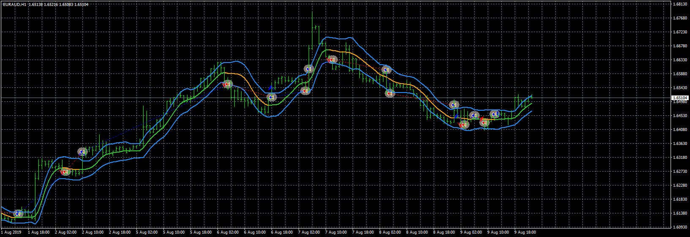

# kaufman_ama_averages_filtered_ATR bands EA

> Source: https://fxcodebase.com/code/viewtopic.php?f=38&t=70137  
> Forum: 38 · Topic 70137 · 1 post(s)

---

## kaufman_ama_averages_filtered_ATR bands EA

**Apprentice** · Tue Jul 07, 2020 8:50 am

Based on request.
[viewtopic.php?f=27&t=70051&p=135720#p135720](https://fxcodebase.com/code/viewtopic.php?f=27&t=70051&p=135720#p135720)

 [kaufman_ama_averages_filtered_ATR bands.mq4](files/135721/kaufman_ama_averages_filtered_ATR%20bands.mq4)

 [kaufman_ama_averages_filtered_ATR bands EA.mq4](files/135721/kaufman_ama_averages_filtered_ATR%20bands%20EA.mq4)
