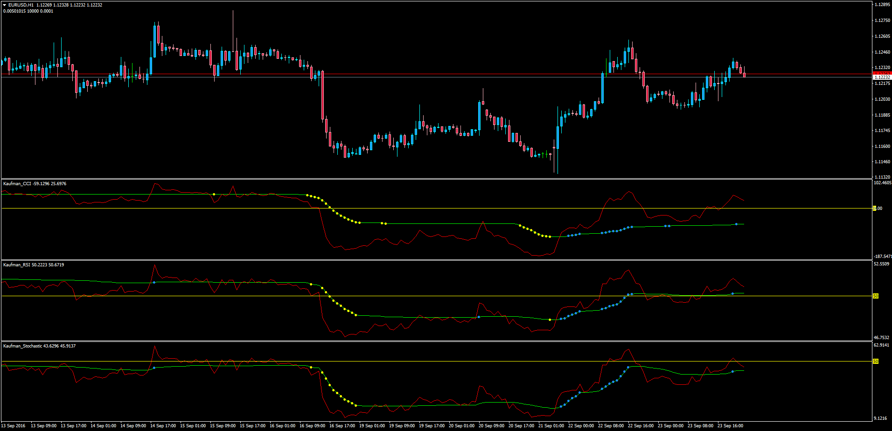
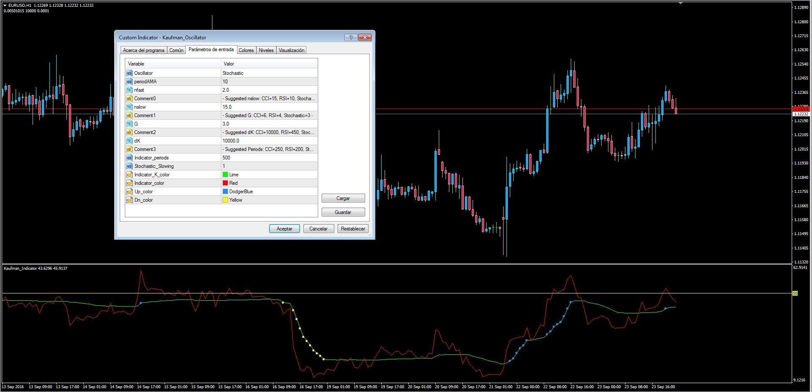

# Kaufman RSI,CCI and Stochastic

> Source: https://fxcodebase.com/code/viewtopic.php?f=38&t=63899  
> Forum: 38 · Topic 63899 · 1 post(s)

---

## Kaufman RSI,CCI and Stochastic

**Apprentice** · Mon Sep 26, 2016 4:15 am

 

LUA Original: [viewtopic.php?f=17&t=1418](https://fxcodebase.com/code/viewtopic.php?f=17&t=1418)

Description:

Developed by Perry Kaufman, this indicators using an Efficiency Ratio to modify the smoothing constant, which ranges from a minimum of Fast Length to a maximum of Slow Length.

The All-In-One oscillator (Kaufman_Oscillator.mq4) has been coded as well with the suggested parameters for the selected oscillator, see picture. If the trader needs to have the 3 indicators running then the individual indicators can be used (Kaufman_CCI.mq4, Kaufman_RSI.mq4 and Kaufman_Stochastic.mq4), but if only one is needed then the all-in-one becomes a perfect suit.

 [Kaufman_CCI.mq4](files/108264/Kaufman_CCI.mq4)

 [Kaufman_RSI.mq4](files/108264/Kaufman_RSI.mq4)

 [Kaufman_Stochastic.mq4](files/108264/Kaufman_Stochastic.mq4)

 [Kaufman_Oscillator.mq4](files/108264/Kaufman_Oscillator.mq4)
