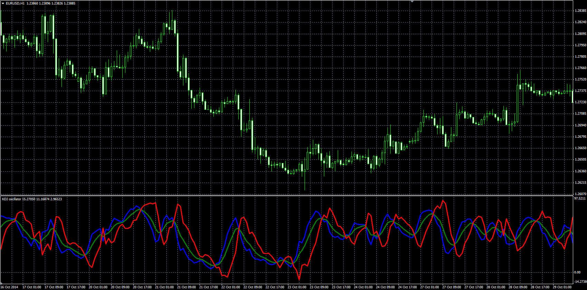
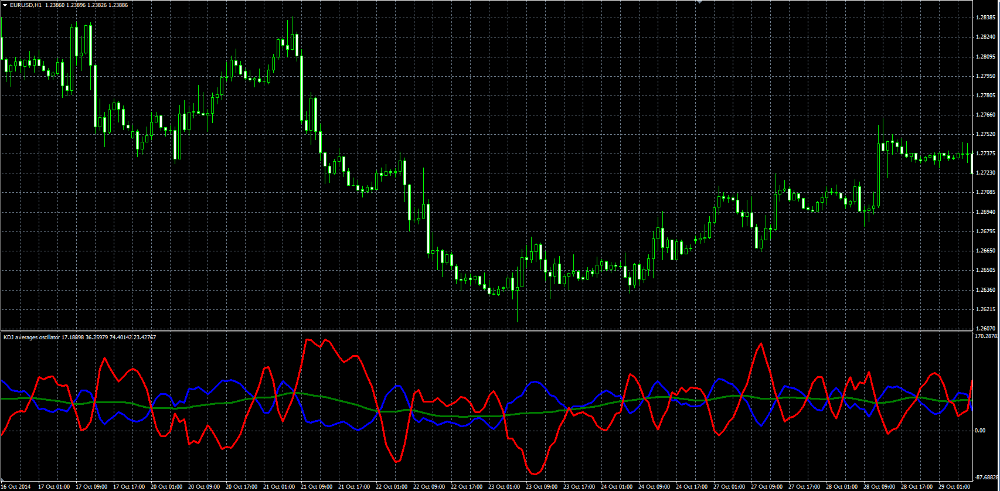

# KDJ oscillator

> Source: https://fxcodebase.com/code/viewtopic.php?f=38&t=61519  
> Forum: 38 · Topic 61519 · 1 post(s)

---

## KDJ oscillator

**Alexander.Gettinger** · Fri Nov 21, 2014 5:08 pm

K line is :
K = ((Current Close – Lowest Low) / (Highest high – Lowest low))* 100

D is simple moving average of the K line. Usually D is 3 day simple moving average of K line but it depends on what trader wants to choose. We have used exponential average.
D = N day simple moving average of K line

‘J’ is the divergence of ‘D’ value from the ‘K’ value.
J = (3*D) – (2*K)

An example of a strategy rules:

Buy – When ‘J’ line crosses above the 50 mark
Sell – When the ‘J’ line crosses below the 50 mark

 

Download:

 [KDJ.mq4](files/97292/KDJ.mq4)

**KDJ Averages:**

 

Download:

 [KDJ_Averages.mq4](files/97292/KDJ_Averages.mq4)
