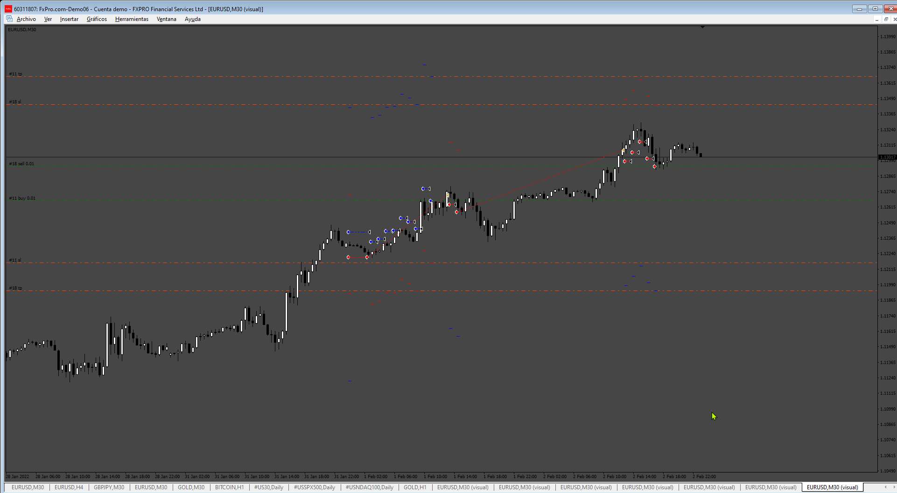
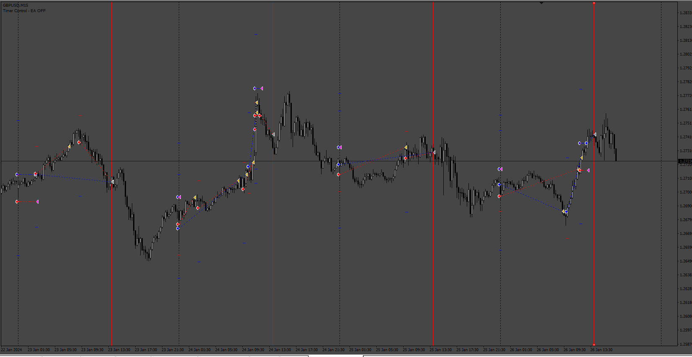

# Kejar_Setoran_EA

> Source: https://fxcodebase.com/code/viewtopic.php?f=38&t=75980  
> Forum: 38 · Topic 75980 · 7 post(s)

---

## Kejar_Setoran_EA

**Apprentice** · Thu May 29, 2025 11:47 am

Based on the request.
[https://fxcodebase.com/code/viewtopic.p ... 28#p159328](https://fxcodebase.com/code/viewtopic.php?f=27&p=159328#p159328)

 [Kejar_Setoran_EA.mq4](files/159405/Kejar_Setoran_EA.mq4)

---

## Re: Kejar_Setoran_EA

**Dewa Forex** · Fri May 30, 2025 5:11 am

Hi,

This EA is not working according to what I expected.

1. The EA is supposed to set BUYSTOP and SELLSTOP at the same time.
2. If one of the pending orders is open (BUYSTOP to BUY) and the price continues to rise, then the price of the SELLSTOP pending order will follow the price movement (trailing price sellstop) and vice versa.
3. If BUY TP or SL then he will reinstall BUYSTOP

---

## Re: Kejar_Setoran_EA

**Apprentice** · Sun Jun 01, 2025 1:42 pm

We have added your request to the development list.
Development reference 361

---

## Re: Kejar_Setoran_EA

**Apprentice** · Wed Jun 04, 2025 2:54 pm

[Kejar_Setoran_EA.mq4](files/159441/Kejar_Setoran_EA.mq4)

Try this version.

---

## Re: Kejar_Setoran_EA

**[email protected]** · Sat Jun 28, 2025 6:47 am

> **Apprentice wrote:**
>
>
> Kejar_Setoran_EA.mq4
>
>
> Try this version.

Hi. Please add these options to the last Version.

1- Spread Filter ( true/false)
 Spread amount : Pips

2- Max daily Profit and loss
 Profit
 Loss

3-Trading Hours limits (true/false)
 Start Hour:
 End Hour:
 Mandatory Close all positions at the end hour: (true/false)

Thanks in advance.

---

## Re: Kejar_Setoran_EA

**Apprentice** · Wed Jul 02, 2025 2:41 pm

We have added your request to the development list.
Development reference 432

---

## Re: Kejar_Setoran_EA

**Apprentice** · Mon Jul 07, 2025 4:25 pm

 [Kejar_Setoran_EA.mq4](files/159856/Kejar_Setoran_EA.mq4)
