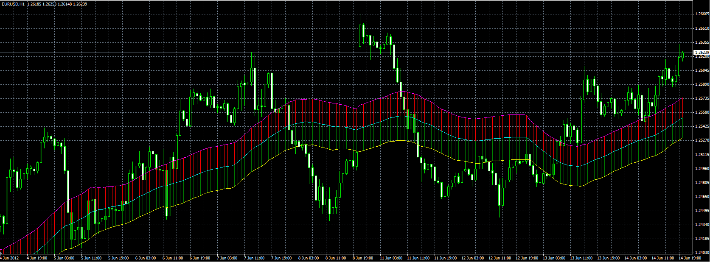

# Keltner channel indicator

> Source: https://fxcodebase.com/code/viewtopic.php?f=38&t=20204  
> Forum: 38 · Topic 20204 · 4 post(s)

---

## Keltner channel indicator

**Alexander.Gettinger** · Thu Jun 14, 2012 3:12 pm

Formulas:
Middle=Moving average(NM, SRC, Method),
Upper=Middle+F*ATR(NB),
Lower=Middle-F*ATR(NB), where
NM - number of periods for MA,
SRC - type of price for MA (0 - Close, 1 - Open, 2 - High, 3 - Low, 4 - Median, 5 - Typical, 6 - Weighted),
Method - method of MA (0 - Simple, 1 - Exponential, 2 - Smoothed, 3 - Linear weighted),
NB - number of periods for ATR,
F - coefficient.

 

Download:

 [Keltner_Cloud.mq4](files/35520/Keltner_Cloud.mq4)

 [Customizable Keltner.mq4](files/35520/Customizable%20Keltner.mq4)

---

## Re: Keltner channel indicator

**jorgelg93** · Sat Aug 08, 2020 11:37 am

How can I limit the lookback bars for the indicator, I mean, I want it to be added at the chart or I want it to look back from now to 100 or 200 bars ago only. How can I do that?

---

## Re: Keltner channel indicator

**Apprentice** · Mon Aug 10, 2020 4:02 am

Your request is added to the development list.
Development reference 1864.

---

## Re: Keltner channel indicator

**Apprentice** · Tue Aug 11, 2020 3:18 am

[Keltner_Cloud.mq4](files/136754/Keltner_Cloud.mq4)

 [Customizable_Keltner.mq4](files/136754/Customizable_Keltner.mq4)

Try it now.
